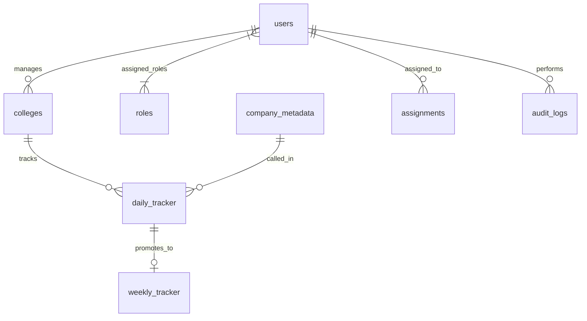

# 📘 Chapter 4 – Backend System Architecture
## 🛠️ Section 4.3.2 – MongoDB Collection Structure Specification

> **Document Status:** Frozen & Approved for V1 Implementation  
> **Database Name:** `ipoms`  
> **Total Active Collections:** 13  
> **Architecture Standard:** Stateless JWT Authentication + Dynamic RBAC Governance + Individual Account Governance  

---

## 📌 Executive Overview

This specification document details the precise data structures, BSON types, validation rules, indexing strategies, and JSON document representations for all **13 MongoDB collections** comprising the iPOMS backend data layer.

### Key Architectural Principles Applied:
1. **Normalized Master Data:** Companies and HR contacts are merged into `company_metadata` for 10x faster Excel imports and 1-to-1 alignment with the UI Master Database table.
2. **Collection ≠ Screen:** Operational collections (`daily_tracker`, `assignments`, `daily_leads`) feed multi-screen dashboards and reports dynamically.
3. **Fresh Daily Start & Month Selector Navigation:** Daily Tracker opens automatically to the current month/day upon login. Users can pick any month (e.g., `August 2026`, `January 2026`) via the header Month Selector / Calendar Picker to view or report on that month's history (`is_finalized = true`).
4. **Single Unified Collection for History:** All historical daily logs remain stored permanently inside the single `daily_tracker` collection — eliminating separate archive tables.
5. **Real-Time Auto-Save & Midnight Finalization:** Daily Tracker runs live auto-save with a Google Docs style status indicator (`● All changes saved`). Coordinators click `Save Progress` freely. The system automatically finalizes the tracker at 11:59:59 PM (`is_finalized = true`).
6. **Month & Year Filterable Daily Leads:** `daily_leads` stores precise timestamps (`created_at`, `email_received_timestamp`), allowing directors to instantly export month/year reports (PDF, Image, Snapshot) for any specific month (e.g. `January 2026`).
7. **Continuous Year-Long Weekly Tracker:** `weekly_tracker` operates on a continuous full academic year basis (`academic_year: 2026`), allowing drives to be updated across weeks and months without monthly resets.
8. **Assigned Context Bridge (`assignments`):** Connects TL/Director company assignments with the specific target client `college_id` and coordinator inbox without polluting the DB with call log details.
9. **Dynamic Serial Numbers:** Table serial numbers (`S.No`) are generated dynamically on the UI (`rowIndex + 1`) to preserve clean sequential ordering during sorting, searching, and filtering.
10. **Duplicate Detection & Focus Warning:** Adding an existing contact (matching Company Name + Mobile OR Company Name + Email) triggers an instant pop-up warning highlighting row index and offering `[Review Existing]`, `[Continue Anyway]`, `[Cancel]`.
11. **Stateless JWT Auth:** Authentication uses cryptographically verified JWT tokens, avoiding database lookup overhead on API requests.
12. **Dynamic RBAC Governance:** System permissions are driven by the `roles` collection for fine-grained, configurable access control with support for multiple roles per user.
13. **Individual Account Accountability:** Every physical user (including CEO and Director) has an individual login account to ensure 100% audit trail traceability.
14. **Dual Status Tracking:** User operational status is split into **Account Status** (system access governance) and **Presence Status** (MS Teams-style daily availability).

---

# 1. `users` ⭐ *(User Accounts & Presence)*
### Purpose
Stores all user accounts, authentication credentials, MS Teams-style presence indicators, personal employee details, multi-role references, assigned college arrays, and account status governance.

### Schema Fields
| Field Name | BSON Type | Required? | Index? | Description & Validation / Enums |
|---|---|---|---|---|
| `_id` | ObjectId | Yes | PK | Primary Key |
| `username` | String | Yes | Unique | 3-30 chars, alphanumeric + underscores, unique login handle |
| `password_hash` | String | Yes | No | Argon2id or bcrypt hashed password string |
| `full_name` | String | Yes | Text | User's full display name |
| `employee_id` | String | Yes | Unique | Company Employee ID (e.g., `INF-2026-014`) |
| `official_email` | String | Yes | Unique | Primary company email address (Login Handle) |
| `personal_email` | String | No | No | Optional recovery/personal email address |
| `primary_mobile` | String | Yes | No | 10-digit primary mobile number |
| `secondary_mobile` | String | No | No | Optional backup contact number |
| `profile_photo_url` | String | No | No | URL to uploaded profile picture or null (initials avatar fallback) |
| `address` | String | No | No | Optional residential/mailing address |
| `date_of_birth` | Date | Yes | No | Date of birth (Must be a past date) |
| `date_of_joining` | Date | Yes | No | Date employee joined Infoziant (Must be a past/present date) |
| `account_status` | String | Yes | Yes | Controls login permission. Enum: `active`, `inactive`, `suspended` |
| `presence_status` | String | Yes | Yes | MS Teams style daily availability. Enum: `available`, `busy`, `be_right_back`, `away`, `appear_offline`, `out_of_office` |
| `is_email_verified` | Boolean | Yes | No | `true` if OTP email verification complete (default `true` for admin creation) |
| `last_password_changed_at` | Date | No | No | ISO Timestamp when user last reset/changed password |
| `role_ids` | Array[ObjectId] | Yes | Yes | Array of Foreign Keys referencing `roles._id` (Supports multi-role e.g. `Director + Admin`) |
| `role_codes` | Array[String] | Yes | Yes | Denormalized array of role codes (e.g., `["director", "admin"]`) |
| `assigned_college_ids` | Array[ObjectId] | No | Yes | References `colleges._id` (coordinators manage ~3 colleges) |
| `created_by` | ObjectId | Yes | No | User who created this account (references `users._id`) |
| `created_at` | Date | Yes | Yes | Immutable creation timestamp |
| `updated_at` | Date | Yes | No | ISO Timestamp of last modification |

---

# 2. `roles` ⭐⭐⭐⭐⭐ *(Dynamic RBAC Roles & Permissions)*
### Purpose
Stores role definitions and fine-grained permission arrays grouped by business module. Supports predefined system roles and custom administrative roles. Roles are never permanently deleted (soft-deactivation via status).

### Schema Fields
| Field Name | BSON Type | Required? | Index? | Description & Validation / Enums |
|---|---|---|---|---|
| `_id` | ObjectId | Yes | PK | Primary Key |
| `role_code` | String | Yes | Unique | Unique System Code (e.g., `placement_coordinator`, `team_leader`, `director`, `ceo`, `tpo`, `admin`) |
| `role_name` | String | Yes | Unique | Human-readable role title (e.g., `Placement Coordinator`, `Team Leader`) |
| `description` | String | No | No | Operational description of the role's scope and purpose |
| `status` | String | Yes | Yes | Controls whether role can be assigned. Enum: `active`, `inactive` (No permanent deletion allowed) |
| `is_system_role` | Boolean | Yes | Yes | `true` for built-in predefined roles; `false` for custom admin roles |
| `permissions` | Array[String] | Yes | Yes | Array of module-scoped permission keys (e.g., `company:create`, `metadata_db:soft_delete`, `daily_tracker:submit_day`) |
| `created_by` | ObjectId | Yes | No | User who created the role (references `users._id`) |
| `created_at` | Date | Yes | No | ISO Timestamp |
| `updated_at` | Date | Yes | No | ISO Timestamp |

---

# 3. `company_metadata` ⭐⭐⭐⭐⭐ *(Master Metadata Database)*
### Purpose
Single master repository storing every company contact row in Infoziant's placement database. Serves as the direct source of truth for the Master Company Database grid, Daily Tracker contact picker, Assignments, Weekly Tracker, Daily Leads, and Reports.

### Schema Fields
| Field Name | BSON Type | Required? | Index? | Description & Validation / Enums |
|---|---|---|---|---|
| `_id` | ObjectId | Yes | PK | Primary Key |
| `company_name` | String | Yes | Text | Mandatory. Primary corporate business key (e.g. `Infosys Limited`) |
| `hr_name` | String | No | Text | Optional HR Full Name |
| `hr_designation` | String | No | No | Optional job title (e.g., `Campus Recruiter`, `HR Lead`) |
| `mobile_numbers` | Array[String] | No | Yes | Optional array of 10-digit mobile numbers |
| `email_ids` | Array[String] | No | Yes | Optional array of valid email addresses |
| `company_type` | String | No | Yes | Optional. Category dropdown value (`software`, `bpo`, `banking`, `finance`, `ai`, `edtech`, `pharma`, `medical`, `core_engineering`) |
| `is_deleted` | Boolean | Yes | Yes | Soft-delete flag (default `false`) |
| `added_by` | ObjectId | Yes | No | References `users._id` |
| `updated_at` | Date | Yes | Yes | ISO Timestamp (auto-updated whenever record is modified) |

---

# 4. `assignments` ⭐⭐⭐⭐⭐ *(Task & Lead Assignment Inbox)*
### Purpose
Stores daily work and company contact assignments created by Team Leaders or Directors and assigned to Placement Coordinators. Operates with an automatic 7-day TTL expiration lifecycle.

### Schema Fields
| Field Name | BSON Type | Required? | Index? | Description & Validation / Enums |
|---|---|---|---|---|
| `_id` | ObjectId | Yes | PK | Primary Key |
| `coordinator_id` | ObjectId | Yes | Yes | Assigned Coordinator (references `users._id`) |
| `assigned_by_id` | ObjectId | Yes | No | Assigning TL/Director (references `users._id`) |
| `college_id` | ObjectId | Yes | Yes | Target Client College (references `colleges._id`) |
| `assignment_source` | String | Yes | Yes | Enum: `metadata`, `manual` |
| `metadata_id` | ObjectId | No | Yes | Pointer to `company_metadata._id` (if source is `metadata`) |
| `company_name` | String | Yes | Text | Targeted Company Name |
| `hr_contact_info` | Object | No | No | Embedded `{ hr_name, mobile, email }` payload |
| `task_description` | String | Yes | No | Task notes / instructions (e.g. *"Call before 11:00 AM regarding drive"*) |
| `priority` | String | Yes | Yes | Enum: `high`, `medium`, `low` |
| `status` | String | Yes | Yes | Enum: `assigned`, `viewed`, `loaded_to_metadata`, `completed` |
| `is_loaded_to_tracker`| Boolean | Yes | Yes | Internal technical load flag (default `false`) |
| `created_at` | Date | Yes | Yes | Timestamp when assigned |
| `completed_at` | Date | No | No | Timestamp when marked completed |
| `expires_at` | Date | Yes | TTL | TTL Index field (auto-purges record 7 days after creation) |

---

# 5. `daily_tracker` ⭐⭐⭐⭐⭐ *(Primary Operational Call Log)*
### Purpose
Primary operational log collection recording every call attempt (~50-70 calls/day per coordinator). Runs live auto-save with a Google Docs style status indicator (`● All changes saved`). Supports free `Save Progress` clicks throughout the day. Past days are viewed as read-only History via the Calendar Picker (`is_finalized = true` set automatically at 11:59:59 PM). Auto-populates `year` and `month` fields from system date for high-speed indexed reporting.

### Schema Fields
| Field Name | BSON Type | Required? | Index? | Description & Validation / Enums |
|---|---|---|---|---|
| `_id` | ObjectId | Yes | PK | Primary Key |
| `coordinator_id` | ObjectId | Yes | Yes | Foreign Key referencing `users._id` |
| `college_id` | ObjectId | Yes | Yes | Foreign Key referencing `colleges._id` |
| `company_id` | ObjectId | Yes | Yes | Foreign Key referencing `company_metadata._id` |
| `company_name` | String | Yes | Text | Denormalized company name for fast grid rendering |
| `hr_name` | String | Yes | No | Denormalized HR name |
| `mobile_number` | String | Yes | No | Phone number called |
| `email_id` | String | No | No | HR Email address |
| `year` | Number | Yes | Compound | Auto-generated year integer (e.g. `2026`). Enables ultra-fast indexing. |
| `month` | Number | Yes | Compound | Auto-generated month integer (`1-12`). Enables ultra-fast indexing. |
| `call_start_time` | Date | Yes | Yes | Timestamp call started (Spacebar / ⏱ Now trigger) |
| `call_end_time` | Date | No | No | Locked timestamp captured when `outcome_status` is chosen |
| `duration_seconds` | Number | Yes | No | Computed call duration (`call_end_time - call_start_time`) |
| `outcome_status` | String | Yes | Yes | Enum: `no_response`, `no_response_2`, `invalid_number`, `not_hiring`, `already_connected`, `follow_up`, `invite_mail`, `drive_scheduled`, `drive_in_progress`, `drive_completed` |
| `follow_up_date` | Date | No | Yes | Target follow-up date (if outcome is `follow_up`) |
| `comments` | String | No | No | Free-text operational call notes |
| `is_skipped` | Boolean | Yes | Yes | `true` if coordinator skipped this contact for today |
| `save_count` | Number | Yes | No | Counter tracking how many times "Save Progress" was clicked today |
| `last_saved_at` | Date | No | No | Timestamp of latest progress save/sync |
| `is_finalized` | Boolean | Yes | Yes | Set to `true` automatically by system at 11:59:59 PM (Locks past dates to Read-Only History) |
| `created_at` | Date | Yes | Yes | ISO Timestamp |

### Sample JSON Document
```json
{
  "_id": {"$oid": "66a801f1e4b0111111111601"},
  "coordinator_id": {"$oid": "66a801f1e4b0111111111101"},
  "college_id": {"$oid": "66a801f1e4b0111111111201"},
  "company_id": {"$oid": "66a801f1e4b0111111111301"},
  "company_name": "Infosys Limited",
  "hr_name": "Ravi Kumar",
  "mobile_number": "9876543210",
  "email_id": "ravi@infosys.com",
  "year": 2026,
  "month": 7,
  "call_start_time": {"$date": "2026-07-29T10:15:00.000Z"},
  "call_end_time": {"$date": "2026-07-29T10:17:30.000Z"},
  "duration_seconds": 150,
  "outcome_status": "invite_mail",
  "follow_up_date": null,
  "comments": "Agreed to review KPR College profile and request JD via email",
  "is_skipped": false,
  "save_count": 4,
  "last_saved_at": {"$date": "2026-07-29T17:30:00.000Z"},
  "is_finalized": false,
  "created_at": {"$date": "2026-07-29T10:17:30.000Z"}
}
```

---

# 6. `weekly_tracker` ⭐⭐⭐⭐⭐ *(Placement Lifecycle Pipeline - Full Academic Year)*
### Purpose
Manages positive placement opportunities continuously throughout the **entire academic year** (e.g., 2026 Placement Season) per `Module_04_Weekly_Tracker_Specification_v1.0.md`. Each college/coordinator maintains its own Weekly Tracker view (`college_id`). One row represents a company's recruitment drive, storing multiple roles in a single cell as a comma-separated string (e.g. `"Software Engineer, Data Analyst"`), with a single rich free-text Status field. Drives automatically organize into sections (Pipeline, In Progress, Completed, Top Companies, Rejected by HR, Rejected by College).

### Schema Fields
| Field Name | BSON Type | Required? | Index? | Description & Validation / Enums |
|---|---|---|---|---|
| `_id` | ObjectId | Yes | PK | Primary Key |
| `academic_year` | Number | Yes | Yes | Full academic placement year (e.g., `2026`). Enables year-long continuous pipeline updates without monthly resets. |
| `college_id` | ObjectId | Yes | Yes | Target Client College (References `colleges._id`). Partitions weekly tracker view per college dashboard. |
| `coordinator_id` | ObjectId | Yes | Yes | Assigned Placement Coordinator (References `users._id`). |
| `company_id` | ObjectId | Yes | Yes | Foreign Key referencing `company_metadata._id`. |
| `company_name` | String | Yes | Text | Official Company Name (e.g. `Infosys Limited`). |
| `job_role` | String | Yes | Text | Comma-separated roles string (e.g. `"Software Engineer, Data Analyst, Full Stack"`). Multiple roles are stored in a single cell, not separate rows. |
| `company_type` | String | Yes | Yes | Category dropdown (`software`, `bpo`, `banking`, `finance`, `ai`, `edtech`, `pharma`, `medical`, `core_engineering`). Shared dropdown enum across Daily & Weekly Trackers. |
| `ctc_lpa` | String | Yes | No | Compensation package or range string (e.g., `"5.0 - 8.0 LPA"` or `"6.5 LPA"`). Used in Top Companies qualification. |
| `eligible_batch` | String | Yes | No | Target batch (e.g., `2026 Batch`). |
| `pipeline_section` | String | Yes | Yes | Section Enum: `pipeline`, `in_progress`, `completed`, `top_companies`, `rejected_by_hr`, `rejected_by_college`. Auto-assigned via backend keyword detection on `current_status_text`. |
| `is_pinned_top` | Boolean | Yes | Yes | Manual pin override flag (`true` forces row into `top_companies` section regardless of CTC). |
| `current_status_text` | String | Yes | Text | Single rich free-text operational notes (e.g., *"Invite email sent, awaiting JD, follow up on July 22"*). |
| `follow_up_date` | Date | No | Yes | Target future date for next HR contact call. Drives section sorting and visual color indicators (Green >7d, Yellow ≤3d, Red = today/overdue). |
| `drive_date` | Date | No | No | Scheduled placement drive date. |
| `total_offers_received` | Number | No | No | Numeric count of students placed / offer letters issued (Active in `completed` section). |
| `originating_daily_tracker_id` | ObjectId | No | No | Pointer to initiating `daily_tracker._id` (if auto-promoted from daily call). |
| `created_at` | Date | Yes | Yes | ISO Timestamp. |
| `updated_at` | Date | Yes | No | ISO Timestamp (Auto-updated whenever coordinator modifies status or follow-up date). Represents the "Last Updated Date". |

### Sample JSON Document
```json
{
  "_id": {"$oid": "66a801f1e4b0111111111701"},
  "academic_year": 2026,
  "college_id": {"$oid": "66a801f1e4b0111111111201"},
  "coordinator_id": {"$oid": "66a801f1e4b0111111111101"},
  "company_id": {"$oid": "66a801f1e4b0111111111301"},
  "company_name": "Infosys Limited",
  "job_role": "Software Engineer, Data Analyst",
  "company_type": "software",
  "ctc_lpa": "5.0 - 8.0 LPA",
  "eligible_batch": "2026 Batch",
  "pipeline_section": "in_progress",
  "is_pinned_top": false,
  "current_status_text": "JD received; Student DB shared; Technical round scheduled for Aug 12",
  "follow_up_date": {"$date": "2026-08-05T00:00:00.000Z"},
  "drive_date": {"$date": "2026-08-12T00:00:00.000Z"},
  "total_offers_received": 0,
  "originating_daily_tracker_id": {"$oid": "66a801f1e4b0111111111601"},
  "created_at": {"$date": "2026-07-29T10:17:30.000Z"},
  "updated_at": {"$date": "2026-07-30T10:00:00.000Z"}
}
```

---

# 7. `daily_leads` ⭐⭐⭐⭐⭐ *(Daily Leads College Workbook Register)*
### Purpose
Operates as a multi-college **Daily Leads Workbook** (Excel-style worksheets per active college). Each client college view (`college_id`) contains two stacked sections: **Section 1: POSITIVE OPPORTUNITIES** and **Section 2: JD RECEIVED**. Tracks daily leads filled by coordinators until 6:00 PM, supporting 1-click `Move to JD Received` actions, manual time strings (`10:15 AM`), multi-batch text (`2027, 2028`), duplicate entry warnings, and high-quality **Image (WhatsApp formatted table snapshot)** & **Excel** exports. Auto-populates `year` and `month` for Director snapshot reports.

### Schema Fields
| Field Name | BSON Type | Required? | Index? | Description & Validation / Enums |
|---|---|---|---|---|
| `_id` | ObjectId | Yes | PK | Primary Key |
| `lead_type` | String | Yes | Yes | Section Enum: `positive` (Section 1: Positive Opportunities) or `jd_received` (Section 2: JD Received). Moving a lead updates this field. |
| `college_id` | ObjectId | Yes | Yes | Target Client College (References `colleges._id`). Partitions workbook sheets per college. |
| `coordinator_id` | ObjectId | Yes | Yes | Foreign Key referencing `users._id` (Coordinator who logged the lead). |
| `company_name` | String | Yes | Text | Official Company Name (e.g. `Infosys Limited`). |
| `job_role` | String | Yes | Text | Role offered/discussed (Supports comma-separated multiple roles e.g. `"Software Engineer, Data Analyst"`). |
| `ctc` | String | Yes | No | Compensation details string or range (e.g., `"5.0 - 8.0 LPA"`). |
| `eligible_batch` | String | Yes | No | Target student batch (e.g., `"2027"` or `"2027, 2028"`). |
| `event_time` | String | Yes | No | Manual time string when business event occurred (e.g. `"10:15 AM"`, `"2:45 PM"`, `"5:30 PM"`). |
| `year` | Number | Yes | Compound | Auto-generated year integer (e.g. `2026`). Enables instant Director month/year indexing. |
| `month` | Number | Yes | Compound | Auto-generated month integer (`1-12`). Enables instant Director month/year indexing. |
| `created_at` | Date | Yes | Yes | ISO Timestamp when record was created. |
| `updated_at` | Date | Yes | No | ISO Timestamp when record was last modified or moved between sections. |

### Sample JSON Document
```json
{
  "_id": {"$oid": "66a801f1e4b0111111111801"},
  "lead_type": "positive",
  "college_id": {"$oid": "66a801f1e4b0111111111201"},
  "coordinator_id": {"$oid": "66a801f1e4b0111111111101"},
  "company_name": "Infosys Limited",
  "job_role": "Software Engineer, Data Analyst",
  "ctc": "5.0 - 8.0 LPA",
  "eligible_batch": "2027, 2028",
  "event_time": "10:15 AM",
  "year": 2026,
  "month": 7,
  "created_at": {"$date": "2026-07-30T10:15:00.000Z"},
  "updated_at": {"$date": "2026-07-30T10:15:00.000Z"}
}
```

---

# 8. `colleges` ⭐⭐⭐⭐⭐ *(Client Colleges Master Repository - FROZEN)*
### Purpose
Master repository storing all client colleges managed by Infoziant. Serves as the central source of truth for Daily Leads Workbooks, Weekly Tracker Boards, Dashboards, and TPO Reports. Adding a college automatically activates its sheet/view across all iPOMS modules. Setting status to `inactive` hides it from active dropdowns while preserving historical data.

### Schema Fields
| Field Name | BSON Type | Required? | Index? | Description & Validation / Enums |
|---|---|---|---|---|
| `_id` | ObjectId | Yes | PK | Primary Key |
| `college_name` | String | Yes | Unique/Text | Mandatory. Official full name (e.g. `"KPR Institute of Engineering and Technology"`). Must be unique. |
| `college_website` | String | Yes | No | Mandatory. Official website URL (e.g., `"https://kpriet.ac.in"`). |
| `location` | String | Yes | Yes | Mandatory. City / District / State (e.g., `"Coimbatore, Tamil Nadu"`). |
| `tpo_name` | String | Yes | Text | Mandatory. Placement Officer Full Name (e.g. `"Dr. S. Ramesh"`). |
| `tpo_contact_mobile` | String | Yes | No | Mandatory. Placement Officer 10-digit mobile number. |
| `tpo_email` | String | Yes | No | Mandatory. Placement Officer official email address. |
| `status` | String | Yes | Yes | Mandatory. Status Enum: `active`, `inactive`, `on_hold` (Default: `active`). |
| `college_code` | String | No | Unique | Optional. Short identifier code (e.g., `"KPRIET"`, `"REC"`, `"PSNA"`, `"NPR"`). Editable. |
| `departments` | Array[String] | No | No | Optional. Array of eligible academic departments (e.g., `["CSE", "IT", "AI & DS", "ECE", "EEE"]`). |
| `student_strength` | Number | No | No | Optional. Approximate eligible placement student count (e.g., `850`). |
| `nirf_ranking` | String | No | No | Optional. NIRF Engineering Rank (e.g., `"101-150"` or `"85"`). |
| `assigned_coordinator_ids` | Array[ObjectId] | No | Yes | Optional. Array of Foreign Keys referencing `users._id` (~3 colleges per coordinator). |
| `created_at` | Date | Yes | No | ISO Timestamp when record was created. |
| `updated_at` | Date | Yes | No | ISO Timestamp when record was last modified. Represents "Last Updated Date". |

### Sample JSON Document
```json
{
  "_id": {"$oid": "66a801f1e4b0111111111201"},
  "college_name": "KPR Institute of Engineering and Technology",
  "college_website": "https://kpriet.ac.in",
  "location": "Coimbatore, Tamil Nadu",
  "tpo_name": "Dr. S. Ramesh",
  "tpo_contact_mobile": "9876543210",
  "tpo_email": "tpo@kpriet.ac.in",
  "status": "active",
  "college_code": "KPRIET",
  "departments": ["CSE", "IT", "AI & DS", "ECE", "EEE"],
  "student_strength": 850,
  "nirf_ranking": "101-150",
  "assigned_coordinator_ids": [{"$oid": "66a801f1e4b0111111111101"}],
  "created_at": {"$date": "2026-07-29T10:00:00.000Z"},
  "updated_at": {"$date": "2026-07-30T10:00:00.000Z"}
}
```

---

# 9. `notifications` ⭐⭐⭐⭐⭐ *(Enterprise Communication & Alerts Engine - FROZEN)*
### Purpose
Centralized, one-way communication engine managing in-app notifications, task assignment alerts, management announcements, system logs, and follow-up reminders. Supports 4 targeted audiences (`everyone`, `individual`, `role_group`, `college_group`), 3 priority levels (`high`, `medium`, `low`), 1-click screen navigation URLs (`action_url`), optional media/document attachments (`attachment_url`), and multi-recipient delivery lifecycle tracking (`recipient_statuses`: `sent` → `delivered` → `read` → `archived`). Integrates with a 2-tier UI system (Top 100 Active Panel + Searchable Monthly History Page).

### Schema Fields
| Field Name | BSON Type | Required? | Index? | Description & Validation / Enums |
|---|---|---|---|---|
| `_id` | ObjectId | Yes | PK | Primary Key |
| `notification_type` | String | Yes | Yes | Type Enum: `assignment` (Task/Lead alerts), `announcement` (Management broadcasts), `system_alert` (Import/Security logs), `reminder` (Follow-up/Tracker due). |
| `sender_id` | ObjectId | Yes | Yes | Foreign Key referencing `users._id` (or System ID). |
| `sender_role` | String | Yes | Yes | Sender Role Enum: `ceo`, `director`, `team_leader`, `system`. |
| `audience_type` | String | Yes | Yes | Audience Scope Enum: `everyone` (All portal users), `individual` (Single user), `role_group` (All Coordinators), `college_group` (Assigned college team). |
| `target_user_ids` | Array[ObjectId] | No | Yes | Array of recipient User IDs (references `users._id`). Null if `audience_type` is `everyone`. |
| `target_college_id` | ObjectId | No | Yes | Target Client College ID (references `colleges._id`). Set if audience is `college_group`. |
| `title` | String | Yes | Text | Headline title (e.g., `"15 New Companies Assigned"`). |
| `message` | String | Yes | Text | Detailed notification message text. |
| `attachment_url` | String | No | No | Optional URL to attached announcement image poster or PDF guidelines document. |
| `priority` | String | Yes | Yes | Priority Enum: `high` (Red badge/banner alert), `medium`, `low` (Default: `medium`). |
| `action_url` | String | No | No | 1-Click deep link URL to relevant screen (e.g., `/assignments`, `/daily-tracker`, `/company-metadata`). |
| `recipient_statuses` | Array[Object] | Yes | No | Array of `{ user_id, status: "sent"|"delivered"|"read"|"archived", read_at: Date }`. Gives Director/CEO 100% exact per-user read receipt visibility for group announcements. |
| `year` | Number | Yes | Compound | Auto-generated year integer (e.g. `2026`). Enables instant Monthly Notification History search. |
| `month` | Number | Yes | Compound | Auto-generated month integer (`1-12`). Enables instant Monthly Notification History search. |
| `created_at` | Date | Yes | Yes | ISO Timestamp when notification was issued. |

### Sample JSON Document
```json
{
  "_id": {"$oid": "66a801f1e4b0111111111901"},
  "notification_type": "announcement",
  "sender_id": {"$oid": "66a801f1e4b011111111102"},
  "sender_role": "director",
  "audience_type": "everyone",
  "target_user_ids": null,
  "target_college_id": null,
  "title": "Independence Day Holiday & Placement Review Meeting",
  "message": "All drives will be paused on Aug 15. Review meeting scheduled for Aug 16 at 10:00 AM.",
  "attachment_url": "https://storage.infoziant.com/announcements/holiday_notice.pdf",
  "priority": "high",
  "action_url": null,
  "recipient_statuses": [
    {
      "user_id": {"$oid": "66a801f1e4b0111111111101"},
      "status": "read",
      "read_at": {"$date": "2026-07-31T10:35:00.000Z"}
    },
    {
      "user_id": {"$oid": "66a801f1e4b0111111111102"},
      "status": "delivered",
      "read_at": null
    }
  ],
  "year": 2026,
  "month": 7,
  "created_at": {"$date": "2026-07-31T10:30:00.000Z"}
}
```

---

# 10. `audit_logs` ⭐⭐⭐⭐⭐ *(Security & Governance Audit Trail - FROZEN)*
### Purpose
Permanent, immutable security audit trail logging every data modification, record deletion, restoration, login event, and permission change. Automatically triggered by backend services before items are soft-deleted or moved to `recycle_bin`. Accessible strictly to `CEO`, `Director`, and `Administrator` roles (`audit_log:view`). Supports 1-click exports to Excel, PDF, and CSV.

### Schema Fields
| Field Name | BSON Type | Required? | Index? | Description & Validation / Enums |
|---|---|---|---|---|
| `_id` | ObjectId | Yes | PK | Primary Key |
| `action_type` | String | Yes | Yes | Action Enum: `LOGIN`, `LOGOUT`, `FAILED_LOGIN`, `CREATE`, `UPDATE`, `DELETE`, `RESTORE`, `IMPORT`, `EXPORT`, `PERMISSION_CHANGE`. |
| `entity_type` | String | Yes | Yes | Collection Enum: `company_metadata`, `users`, `colleges`, `assignments`, `daily_tracker`, `weekly_tracker`, `daily_leads`, `roles`, `app_settings`. |
| `entity_id` | ObjectId | Yes | Yes | Foreign Key of target document modified or deleted. |
| `performed_by` | ObjectId | Yes | Yes | Foreign Key referencing `users._id` (User who executed the action). |
| `performed_by_role` | String | Yes | No | Denormalized user role code (e.g. `director`, `admin`, `team_leader`). |
| `module_name` | String | Yes | Yes | Business Module (e.g. `"Master Metadata DB"`, `"User Management"`, `"Weekly Tracker"`, `"Roles & Governance"`). |
| `severity` | String | Yes | Yes | Severity Enum: `info` (Normal log), `warning` (Password reset/import), `critical` (Record deletion, permission change, 3+ failed logins). |
| `summary_message` | String | Yes | Text | Human-readable log summary (e.g. `"Soft-deleted Infosys Limited contact and moved to Recycle Bin"`). |
| `changes_snapshot` | Object | No | No | Exact diff payload `{ before: { hr_mobile: "9876543210" }, after: { hr_mobile: "9123456789" } }`. Null for pure deletes/logins. |
| `ip_address` | String | No | No | Client IP address. |
| `user_agent` | String | No | No | Client browser user-agent string. |
| `created_at` | Date | Yes | Yes | Immutable creation timestamp. Entries can never be edited or deleted by any user. |

### Sample JSON Document
```json
{
  "_id": {"$oid": "66a801f1e4b0111111112001"},
  "action_type": "DELETE",
  "entity_type": "company_metadata",
  "entity_id": {"$oid": "66a801f1e4b0111111111301"},
  "performed_by": {"$oid": "66a801f1e4b0111111111102"},
  "performed_by_role": "director",
  "module_name": "Master Metadata DB",
  "severity": "critical",
  "summary_message": "Soft-deleted Infosys Limited HR record and created Recycle Bin backup",
  "changes_snapshot": {
    "before": { "company_name": "Infosys Limited", "hr_name": "Ravi Kumar", "is_deleted": false },
    "after": { "company_name": "Infosys Limited", "hr_name": "Ravi Kumar", "is_deleted": true }
  },
  "ip_address": "192.168.1.45",
  "user_agent": "Mozilla/5.0 (Windows NT 10.0; Win64; x64)",
  "created_at": {"$date": "2026-07-31T11:45:00.000Z"}
}
```

---

# 11. `import_processing_history` ⭐⭐⭐⭐⭐ *(Bulk Excel Import & Processing Audit - FROZEN)*
### Purpose
Stores processing history, row counts, duplicate skip metrics, and detailed row-level error logs for bulk Excel (`.xlsx`) import operations (e.g. initial 5,000–10,000 master company dataset imports or subsequent 400–1,000 row batch updates). Supports 3 **Smart Import Modes** (`add_new_only`, `update_existing`, `replace_all`), Windows File Explorer style duplicate row detection, live progress bar streaming, first 10 rows preview, downloadable **Failure Error Reports (`.xlsx`)**, and automatic **Audit Log** creation. Logs auto-purge permanently after **90 Days** via MongoDB TTL index.

### Schema Fields
| Field Name | BSON Type | Required? | Index? | Description & Validation / Enums |
|---|---|---|---|---|
| `_id` | ObjectId | Yes | PK | Primary Key |
| `filename` | String | Yes | No | Original uploaded Excel file name (e.g. `Master_Metadata_July2026.xlsx`). |
| `file_format` | String | Yes | No | Format Enum: `.xlsx` (Excel files only, CSV restricted). |
| `file_size_mb` | Number | Yes | No | File size in Megabytes (Max 10 MB limit per batch). |
| `imported_by` | ObjectId | Yes | Yes | Foreign Key referencing `users._id` (Coordinator / Director / Admin). |
| `imported_by_name` | String | Yes | No | Denormalized display name of the importer. |
| `target_collection` | String | Yes | Yes | Target Collection Enum: `company_metadata`, `colleges`. |
| `import_mode` | String | Yes | Yes | Smart Mode Enum: `add_new_only` (Skip duplicates), `update_existing` (Update matching HR contacts), `replace_all` (Overwrite existing). |
| `total_rows` | Number | Yes | No | Total count of data rows parsed from Excel sheet. |
| `successful_imports` | Number | Yes | No | Count of successfully inserted or updated rows. |
| `duplicate_rows` | Number | Yes | No | Count of skipped duplicate rows (matching Company Name + HR Mobile/Email). |
| `failed_rows` | Number | Yes | No | Count of invalid or malformed rows. |
| `processing_status` | String | Yes | Yes | Lifecycle Enum: `pending`, `processing`, `completed`, `partially_completed`, `failed`. |
| `error_log` | Array[Object] | No | No | Array of `{ row_number: 14, company_name: "Wipro", field: "mobile", error: "Invalid mobile number format" }`. Powers 1-click Downloadable Failure Excel Reports. |
| `created_at` | Date | Yes | TTL | ISO Timestamp when import job started. **Auto-purges permanently after 90 days** via TTL index. |

### Sample JSON Document
```json
{
  "_id": {"$oid": "66a801f1e4b0111111114001"},
  "filename": "Master_Company_Metadata_July2026.xlsx",
  "file_format": ".xlsx",
  "file_size_mb": 4.2,
  "imported_by": {"$oid": "66a801f1e4b0111111111101"},
  "imported_by_name": "Priya Sharma",
  "target_collection": "company_metadata",
  "import_mode": "add_new_only",
  "total_rows": 500,
  "successful_imports": 492,
  "duplicate_rows": 5,
  "failed_rows": 3,
  "processing_status": "partially_completed",
  "error_log": [
    {
      "row_number": 14,
      "company_name": "Wipro Technologies",
      "field": "mobile_numbers",
      "error": "Invalid 8-digit mobile number string '9876543'"
    },
    {
      "row_number": 208,
      "company_name": "Unknown Entity",
      "field": "company_name",
      "error": "Mandatory field 'company_name' is blank"
    }
  ],
  "created_at": {"$date": "2026-08-01T10:00:00.000Z"}
}
```

---

# 12. `recycle_bin` ⭐⭐⭐⭐⭐ *(Centralized Soft-Delete Storage - FROZEN)*
### Purpose
Centralized soft-delete recovery system preserving deleted records from all major operational collections. Stores full BSON document snapshots, deletion timestamps, `deleted_by` attribution, and optional deletion reasons. Restores records back to their **exact original collection position and college view** with automatic **Restore Validation** (conflict check against existing active records). Auto-purges items permanently after **90 Days** via MongoDB TTL index. Permanent purge and emptying permissions are restricted strictly to `CEO`, `Director`, and `Administrator` roles.

### Schema Fields
| Field Name | BSON Type | Required? | Index? | Description & Validation / Enums |
|---|---|---|---|---|
| `_id` | ObjectId | Yes | PK | Primary Key |
| `original_collection` | String | Yes | Yes | Collection Enum: `company_metadata`, `daily_leads`, `colleges`, `users`, `assignments`, `daily_tracker`, `weekly_tracker`. |
| `original_id` | ObjectId | Yes | Yes | Foreign Key pointing to the original deleted document ID. |
| `company_name` | String | Yes | Text | Denormalized company or entity name for fast search/grid display in Recycle Bin UI. |
| `document_payload` | Object | Yes | No | Complete JSON snapshot of the full document prior to deletion. |
| `deleted_by` | ObjectId | Yes | Yes | Foreign Key referencing `users._id` (User who deleted the record). |
| `deleted_by_name` | String | Yes | No | Denormalized display name of the user who deleted it. |
| `deletion_reason` | String | No | No | Optional user notes describing reason for deletion. |
| `restore_status` | String | Yes | Yes | Lifecycle Enum: `deleted` (Active in bin), `restored` (Restored to exact original position), `purged` (Permanently deleted). |
| `restored_by` | ObjectId | No | No | References `users._id` (User who executed the restore action). |
| `restored_at` | Date | No | No | Timestamp when restored back to active database. |
| `deleted_at` | Date | Yes | TTL | ISO Timestamp when deleted. **Auto-purges permanently after 90 days** via TTL index. |

### Sample JSON Document
```json
{
  "_id": {"$oid": "66a801f1e4b0111111113001"},
  "original_collection": "company_metadata",
  "original_id": {"$oid": "66a801f1e4b0111111111301"},
  "company_name": "Infosys Limited",
  "document_payload": {
    "_id": {"$oid": "66a801f1e4b0111111111301"},
    "company_name": "Infosys Limited",
    "hr_name": "Ravi Kumar",
    "mobile_numbers": ["9876543210"],
    "email_ids": ["ravi@infosys.com"],
    "company_type": "software",
    "is_deleted": true
  },
  "deleted_by": {"$oid": "66a801f1e4b0111111111101"},
  "deleted_by_name": "Priya Sharma",
  "deletion_reason": "Duplicate contact entered by mistake",
  "restore_status": "deleted",
  "restored_by": null,
  "restored_at": null,
  "deleted_at": {"$date": "2026-07-31T12:00:00.000Z"}
}
```

---

# 13. `app_settings` ⭐⭐⭐⭐⭐ *(Central Application Control Panel & Dynamic Configurations - FROZEN)*
### Purpose
Central control panel collection storing system-wide configuration parameters, dynamic dropdown enums (`company_types`, `academic_years`, `college_departments`, `call_outcomes`, `weekly_tracker_statuses`), branding assets (`logo_url`, `theme_color`), and retention thresholds (`recycle_bin_retention_days: 90`). Eliminates hardcoded values across frontend and backend. All Enable/Disable feature flags are completely removed. Updates apply in real-time without server restarts. Admin/Director edit permissions strictly enforced; every change automatically generates an **Audit Log**. Organized on the UI via a Windows Settings style categorized sidebar (`General`, `Dropdowns & Enums`, `Notifications`, `Imports & Retention`, `Branding & Theme`). Never used as a dumping ground for raw business data.

### Schema Fields
| Field Name | BSON Type | Required? | Index? | Description & Validation / Enums |
|---|---|---|---|---|
| `_id` | ObjectId | Yes | PK | Primary Key |
| `key` | String | Yes | Unique | Unique Config Key (e.g., `company_types`, `call_outcomes`, `academic_years`, `college_departments`, `org_branding`, `recycle_bin_retention_days`). |
| `category` | String | Yes | Yes | Settings Group Enum: `general`, `dropdowns`, `notifications`, `imports`, `reports`, `dashboard`, `appearance`. |
| `value` | Mixed | Yes | No | Config Payload (Array of strings/numbers, Object, Boolean, or String). |
| `description` | String | No | No | Human-readable operational description of what this setting controls. |
| `is_system_locked` | Boolean | Yes | Yes | `true` for built-in core keys that cannot be deleted from the database. |
| `updated_by` | ObjectId | Yes | No | Foreign Key referencing `users._id` (Administrator / Director who last edited setting). |
| `updated_at` | Date | Yes | No | ISO Timestamp when setting was last modified. |

### Sample JSON Document
```json
{
  "_id": {"$oid": "66a801f1e4b0111111115001"},
  "key": "company_types",
  "category": "dropdowns",
  "value": [
    "software",
    "bpo",
    "banking",
    "finance",
    "ai",
    "edtech",
    "pharma",
    "medical",
    "core_engineering"
  ],
  "description": "Master list of company industry dropdown options used across Metadata DB, Daily Tracker, and Weekly Tracker",
  "is_system_locked": true,
  "updated_by": {"$oid": "66a801f1e4b0111111111102"},
  "updated_at": {"$date": "2026-08-01T10:00:00.000Z"}
}
```

---

## 🔗 Foreign Key Cross-Reference Matrix


