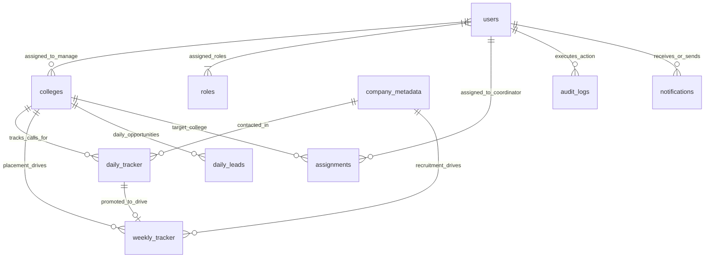

# 📘 Chapter 05 – Database Engineering & API Specifications

> **Document Status:** Official Production Technical Specification & Single Source of Truth  
> **Database Engine:** MongoDB 7.0+ (via Mongoose ODM)  
> **Backend Framework:** Node.js / Express.js  
> **Base API Endpoint:** `/api/v1`  
> **Target Audience:** Backend Developers & AI Coding Assistants (Claude Code, Cursor AI)  

---

## 5.1 Database Overview

### 5.1.1 Introduction
The purpose of this chapter is to translate the approved business architecture into a production-ready database and API specification. It serves as the primary technical reference for backend developers implementing the iPOMS application. Every collection, schema, validation rule, relationship, and REST API defined in this chapter is based on the business decisions approved in Chapter 4. The objective is to ensure that all developers implement the backend consistently without making independent design assumptions.

---

### 5.1.2 Technology Stack

| Layer | Technology | Operational Role |
|---|---|---|
| **Database** | MongoDB 7.0+ | Core NoSQL Document Database Engine |
| **ODM** | Mongoose 8.0+ | Object Data Modeling & Schema Validation |
| **Backend Framework** | Node.js + Express.js | REST API Runtime & Business Logic |
| **Authentication** | Stateless JWT | Cryptographically signed bearer token authorization |
| **API Style** | RESTful JSON | Plural resource-oriented endpoints (`/api/v1`) |
| **Data Format** | BSON / JSON | Binary JSON storage & JSON API payloads |
| **Database Hosting** | MongoDB Atlas / Self-Hosted | Production-grade database cluster deployment |

---

### 5.1.3 Database Collections Overview

| # | Collection Name | Primary Operational Purpose |
|---|---|---|
| 1 | `users` | Employee accounts, login credentials, and MS Teams availability status |
| 2 | `roles` | Dynamic RBAC role definitions and module permission arrays |
| 3 | `colleges` | Master client colleges repository |
| 4 | `company_metadata` | Master corporate company & HR contact repository |
| 5 | `daily_tracker` | Primary operational call logs (~50-70 calls/day, auto-save & midnight finalization) |
| 6 | `weekly_tracker` | Continuous academic year placement pipeline management |
| 7 | `daily_leads` | Multi-college daily positive leads and JD tracking sheets |
| 8 | `notifications` | In-app announcement broadcasts and task alert engine |
| 9 | `audit_logs` | Immutable security audit trail logging system events |
| 10 | `recycle_bin` | Centralized soft-delete recovery system (90-Day TTL) |
| 11 | `import_processing_history` | Bulk Excel `.xlsx` import audit and row-level error reports (90-Day TTL) |
| 12 | `app_settings` | Central application control panel & dynamic dropdown enums |
| 13 | `report_library` | Standardized report definitions & export configurations |

---

### 5.1.4 Database Design Principles

1. **Principle 1 — Dedicated Collection per Business Entity:** Each core business entity is stored in a dedicated MongoDB collection.
2. **Principle 2 — Standard Primary Key Identifier:** MongoDB's native 12-byte BSON `_id` (`ObjectId`) is used as the primary key for all collections.
3. **Principle 3 — Explicit Foreign Key References:** Collections reference each other using `ObjectId` pointers (`ref: 'ModelName'`) where entity relationships exist.
4. **Principle 4 — Strict API Encapsulation:** Business workflows are implemented through secure REST APIs, never through direct database manipulation.
5. **Principle 5 — Uniform Schema & Naming Conventions:** Every collection follows strict `snake_case` field naming and lowercase enum conventions.
6. **Principle 6 — Centralized Soft-Delete Architecture:** Record deletions are executed through the approved `recycle_bin` backup architecture.
7. **Principle 7 — Mandatory Security Audit Logging:** All data-modifying operations trigger an automated entry in the `audit_logs` collection.
8. **Principle 8 — Version 1 Focus with Future Scalability:** Schemas and indexes are optimized for V1 execution while maintaining clean extension points.

---

## 5.2 Collection Engineering Specifications

Every collection below follows a reusable 8-point engineering structure containing Mongoose schemas, BSON data types, validation rules, compound indexes, sample JSON documents, and REST API payload contracts.

---


### 5.2.1 `users` ⭐ *(User Accounts & Presence)*

#### 1. Collection Overview
- **Collection Name:** `users`
- **Purpose:** Stores all authenticated employee user accounts (`official_email`), password hashes, MS Teams availability presence status, personal contact details, dynamic assigned college arrays (`assigned_college_ids`), and RBAC role references (`role_ids`).
- **Primary Owner:** `Administrator`, `Director` (Management Governance)
- **Modules Using This Collection:** Login & Authentication, User Management, Coordinator Assignments, Daily Tracker, Weekly Tracker, Daily Leads, Notifications, Audit Logs.

---

#### 2. Field Specifications Matrix
| Section | Field Name | BSON Data Type | Required | Default Value | Unique | Indexed | Description & Validation |
|---|---|---|---|---|---|---|---|
| PK | `_id` | ObjectId | Yes | Auto | Yes | PK | Primary Key |
| Identity | `username` | String | Yes | None | Yes | Yes | 3-30 chars, alphanumeric handle |
| Identity | `full_name` | String | Yes | None | No | Text | Employee full display name |
| Identity | `official_email` | String | Yes | None | Yes | Yes | Login Handle (Infoziant Email) |
| Identity | `personal_email` | String | No | null | No | No | Optional recovery email |
| Section | Field Name | BSON Data Type | Required | Default Value | Unique | Indexed | Description & Validation |
|---|---|---|---|---|---|---|---|
| PK | `_id` | ObjectId | Yes | Auto | Yes | PK | Primary Key |
| Identity | `username` | String | Yes | None | Yes | Yes | 3-30 chars, alphanumeric handle |
| Identity | `full_name` | String | Yes | None | No | Text | Employee full display name |
| Identity | `official_email` | String | Yes | None | Yes | Yes | Login Handle (Infoziant Email, Director/Admin Editable Only) |
| Identity | `personal_email` | String | No | null | No | No | Optional recovery email |
| Identity | `primary_mobile` | String | Yes | None | Yes | Yes | 10-digit primary mobile (Unique per employee) |
| Identity | `secondary_mobile` | String | No | null | No | No | Optional secondary mobile contact number |
| Auth | `password_hash` | String | Yes | None | No | No | Argon2id / bcrypt hash (`select: false`) |
| Auth | `is_email_verified` | Boolean | Yes | `true` | No | No | Email OTP verification status |
| Auth | `last_password_changed_at` | Date | No | null | No | No | Password last reset timestamp |
| Auth | `last_login_at` | Date | No | null | No | No | Timestamp of last successful login |
| Org | `role_ids` | Array[ObjectId] | Yes | None | No | Yes | References `roles._id` (Multi-role RBAC) |
| Org | `role_codes` | Array[String] | Yes | None | No | Yes | Enums: `admin`, `director`, `ceo`, `team_leader`, `placement_coordinator` |
| Org | `assigned_college_ids` | Array[ObjectId] | No | `[]` | No | Yes | Dynamic array referencing `colleges._id` (0 to 3 max per coordinator) |
| Profile | `profile_photo_url` | String | No | null | No | No | S3/Disk storage image URL path |
| Profile | `address` | String | No | null | No | No | Mailing address string |
| Profile | `date_of_birth` | Date | Yes | None | No | No | Birth date (Must be past date) |
| Profile | `date_of_joining` | Date | Yes | None | No | No | Date joined Infoziant |
| Governance| `account_status` | String | Yes | `active` | No | Yes | Enum: `active`, `inactive`, `suspended` |
| Governance| `presence_status` | String | Yes | `available` | No | Yes | Enum: `available`, `busy`, `be_right_back`, `away`, `appear_offline`, `out_of_office` |
| Governance| `created_by` | ObjectId | Yes | None | No | No | Account creator FK (`users._id`) |
| Governance| `created_at` | Date | Yes | Auto | No | Yes | Creation timestamp |
| Governance| `updated_at` | Date | Yes | Auto | No | No | Update timestamp |

---

#### 3. Collection Relationships
- **Parent Relationships:**
  - `role_ids` ➔ References `roles._id` (Many-to-Many RBAC)
  - `assigned_college_ids` ➔ References `colleges._id` (Dynamic allocation: 0 to 3 max colleges per coordinator)
  - `created_by` ➔ References `users._id` (Self-referential creation audit FK)
- **Child Collections Depending on `users`:**
  - `daily_tracker.coordinator_id` ➔ References `users._id`
  - `weekly_tracker.coordinator_id` ➔ References `users._id`
  - `daily_leads.coordinator_id` ➔ References `users._id`
  - `assignments.coordinator_id` & `assigned_by_id` ➔ References `users._id`
  - `audit_logs.performed_by` ➔ References `users._id`
  - `notifications.sender_id` & `target_user_ids` ➔ References `users._id`

---

#### 4. REST API Contracts
| Method | Endpoint Route | Access Guard | Description | Example Request JSON | Example Response JSON |
|---|---|---|---|---|---|
| `POST` | `/api/v1/auth/login` | Public | Authenticates credentials & returns JWT | `{"official_email":"...","password":"..."}` | `{"success":true,"data":{"token":"..."}}` |
| `GET` | `/api/v1/auth/me` | JWT Auth | Fetches current user profile & colleges | None | `{"success":true,"data":{"user_id":"..."}}` |
| `GET` | `/api/v1/users` | Admin / Director | Paginated search list of system users | `GET /api/v1/users?role=placement_coordinator` | `{"success":true,"data":[...],"meta":{...}}` |
| `POST` | `/api/v1/users` | Admin / Director | Creates a new employee user account | `{"username":"karthik_v","official_email":"..."}` | `{"success":true,"statusCode":201,"data":{...}}` |
| `PUT` | `/api/v1/users/:id` | Admin / Director | Updates user profile details | `{"full_name":"Karthik V","primary_mobile":"..."}`| `{"success":true,"message":"User updated"}` |
| `PUT` | `/api/v1/users/:id/colleges` | Team Leader / Director | Reallocates assigned colleges array | `{"assigned_college_ids":["id1","id2"]}` | `{"success":true,"message":"Colleges reallocated"}` |
| `PATCH` | `/api/v1/users/:id/presence` | JWT Auth (Self) | Updates MS Teams presence status | `{"presence_status":"busy"}` | `{"success":true,"message":"Presence updated"}` |
| `DELETE`| `/api/v1/users/:id` | Admin Only | Soft-deletes user account & saves snapshot | None | `{"success":true,"message":"User deactivated"}` |

---

#### 5. Engineering Notes
- **Login Identity:** Login handle is strictly `official_email` (or `username`). No custom Employee ID required.
- **Email Security Governance:** Users cannot edit their own `official_email`. Only Directors/Admins can edit `official_email` via `PUT /api/v1/users/:id`.
- **Unique Primary Mobile:** `primary_mobile` is enforced as `unique: true` to prevent duplicate employee records and ensure 1-to-1 mobile SMS/WhatsApp mapping.
- **Auto-Clearing on Resignation:** Setting `account_status: "inactive"` or `"suspended"` automatically clears `assigned_college_ids: []` so client colleges can be immediately reassigned by Team Leaders to active coordinators. Historical logs retain `coordinator_id` FK references for 100% audit integrity.
- **Last Login Tracking:** `last_login_at` stores the timestamp of the latest successful login. Detailed login security history is captured in `audit_logs`.
- **Role Referencing + Fast Checks:** Stores `role_ids` (referencing `roles._id`) for relational integrity AND `role_codes` (string enum array) for zero-join permission checks.
- **Dynamic College Allocation:** `assigned_college_ids` is an array of College ObjectIds. Team Leaders can dynamically assign 1, 2, or 3 colleges to a coordinator via `PUT /api/v1/users/:id/colleges`, or clear assigned colleges without breaking historical call records.
- **Password Hashing:** Passwords hashed with Argon2id + salt; `password_hash` has `select: false`.
- **Soft Delete Behavior:** Sets `account_status: "inactive"` and stores a snapshot in `recycle_bin`.


---

### 5.2.2 `roles` ⭐ *(Dynamic RBAC Governance)*

#### 1. Collection Overview
- **Collection Name:** `roles`
- **Purpose:** Stores the master list of system security roles (`role_code`, `role_name`) and their module permission keys. Every authenticated user is assigned a role that dynamically controls what modules, screens, and actions they can perform.
- **Primary Owner:** `Administrator` (Security Governance)
- **Modules Using This Collection:** User Access Management (Module 08), Authentication Middleware, User Management (Module 01), All Business Modules (Permission checking).

---

#### 2. Field Specifications Matrix
| Section | Field Name | BSON Data Type | Required | Default Value | Unique | Indexed | Description & Validation |
|---|---|---|---|---|---|---|---|
| PK | `_id` | ObjectId | Yes | Auto | Yes | PK | Primary Key |
| Role Info | `role_code` | String | Yes | None | Yes | Yes | Fixed lowercase slug e.g. `admin`, `director`, `ceo`, `team_leader`, `placement_coordinator` |
| Role Info | `role_name` | String | Yes | None | Yes | Yes | Fixed title e.g. "Placement Coordinator" (Un-renamable for system roles) |
| Role Info | `description` | String | No | null | No | No | Human-readable role description |
| Permissions| `permissions` | Object | Yes | `{}` | No | No | Structured module permission matrix `{ users: { view: true, add: true, edit: true, delete: true } }` |
| Permissions| `permission_keys` | Array[String] | Yes | `[]` | No | Yes | Denormalized permission array e.g. `["users:view", "daily_tracker:create"]` for 0-ms JWT authorization |
| Governance | `is_system_locked` | Boolean | Yes | `false` | No | No | `true` for the 5 built-in system roles to prevent deletion or renaming |
| Governance | `is_super_admin` | Boolean | Yes | `false` | No | No | `true` for `admin` role to bypass all permission checks |
| Governance | `status` | String | Yes | `active` | No | Yes | Enum: `active`, `inactive` |
| Metadata | `created_by` | ObjectId | Yes | None | No | No | Creator FK referencing `users._id` |
| Metadata | `created_at` | Date | Yes | Auto | No | Yes | Creation timestamp |
| Metadata | `updated_at` | Date | Yes | Auto | No | No | Update timestamp |

---

#### 3. Collection Relationships
- **Parent Relationships:**
  - `created_by` ➔ References `users._id` (Audit creation pointer)
- **Child Collections Depending on `roles`:**
  - `users.role_ids` ➔ Foreign Key pointer array referencing `roles._id`

---

#### 4. REST API Contracts
| Method | Endpoint Route | Access Guard | Description | Example Request JSON | Example Response JSON |
|---|---|---|---|---|---|
| `GET` | `/api/v1/roles` | JWT Auth | Search/list all active security roles & permission matrices | None | `{"success":true,"data":[...],"meta":{...}}` |
| `GET` | `/api/v1/roles/:id` | JWT Auth | Fetches single role permissions matrix | None | `{"success":true,"data":{"role_code":"director",...}}` |
| `PUT` | `/api/v1/roles/:id/permissions` | Admin Only | Updates permissions matrix of a role | `{"permission_keys":["daily_tracker:view_all"]}` | `{"success":true,"message":"Role permissions updated"}` |

---

#### 5. Engineering Notes
- **Fixed System Roles (V1 Locked):** 5 core system roles (`admin`, `director`, `ceo`, `team_leader`, `placement_coordinator`) are seeded during database initialization with `is_system_locked = true`. They can NEVER be deleted or renamed.
- **Administrator Full Bypass:** `admin` role has `is_super_admin = true`, bypassing permission checks across all modules.
- **CEO Read-All Governance:** `ceo` role automatically has `view` permission enabled for all modules, dashboards, reports, and audit logs.
- **Zero Database Joins:** Active `permission_keys` are encoded directly into the user's JWT bearer token payload upon login for 0-ms authorization checks on backend middleware.
- **Dynamic Permission Updates:** Modifying a role's permissions updates the `roles` document. Changing permissions requires zero backend code modifications.
- **No Delete API:** Roles are permanent system configurations. No `DELETE` endpoint is provided for system locked roles.


---

### 5.2.3 `colleges` ⭐ *(Client Colleges Repository)*

#### 1. Collection Overview
- **Collection Name:** `colleges`
- **Purpose:** Stores the master repository of all client colleges partnered with Infoziant. Each document contains college identity details, placement officer (TPO) contact info, website, departments array, NIRF ranking, student strength, and active operational status.
- **Primary Owner:** `Director` (Client Partnership Governance)
- **Modules Using This Collection:** User Management (College allocation), Assignments, Daily Leads, Weekly Tracker, Reports & Analytics, Dynamic Dashboards.

---

#### 2. Field Specifications Matrix
| Section | Field Name | BSON Data Type | Required | Default Value | Unique | Indexed | Description & Validation |
|---|---|---|---|---|---|---|---|
| PK | `_id` | ObjectId | Yes | Auto | Yes | PK | Primary Key |
| College Info | `college_name` | String | Yes | None | Yes | Text | Official full college name |
| College Info | `short_name` | String | No | null | No | Yes | Short display name e.g. "KCT", "PSG Tech" |
| College Info | `college_code` | String | No | null | Yes | Yes | Unique internal code e.g. `KCT-CBE` |
| College Info | `college_location` | String | Yes | None | No | Yes | City/State location e.g. "Coimbatore, Tamil Nadu" |
| College Info | `college_website` | String | Yes | None | No | No | Official website URL string |
| TPO Details | `tpo_name` | String | Yes | None | No | No | Primary Placement Officer name |
| TPO Details | `tpo_mobile` | String | Yes | None | No | Yes | TPO 10-digit primary mobile contact |
| TPO Details | `tpo_email` | String | Yes | None | No | Yes | TPO official email address |
| Academic | `departments` | Array[String] | No | `[]` | No | No | Departments array e.g. `["CSE", "ECE", "EEE", "Mechanical", "MBA"]` |
| Academic | `student_strength` | Number | No | null | No | No | Total eligible student count (min: 0) |
| Academic | `nirf_ranking` | Number | No | null | No | No | NIRF Rank integer (`null` if Not Ranked) |
| Governance | `is_active` | Boolean | Yes | `true` | No | Yes | Soft toggle: setting `false` hides from active dropdowns |
| Governance | `is_deleted` | Boolean | Yes | `false` | No | Yes | Soft-delete recovery flag |
| Metadata | `created_by` | ObjectId | Yes | None | No | No | Creator FK referencing `users._id` |
| Metadata | `created_at` | Date | Yes | Auto | No | Yes | Creation timestamp |
| Metadata | `updated_at` | Date | Yes | Auto | No | No | Update timestamp |

---

#### 3. Collection Relationships
- **Parent Relationships:**
  - `created_by` ➔ References `users._id` (Audit creator pointer)
- **Child Collections Depending on `colleges`:**
  - `users.assigned_college_ids` ➔ References `colleges._id`
  - `daily_tracker.college_id` ➔ References `colleges._id`
  - `weekly_tracker.college_id` ➔ References `colleges._id`
  - `daily_leads.college_id` ➔ References `colleges._id`
  - `assignments.college_id` ➔ References `colleges._id`

---

#### 4. REST API Contracts
| Method | Endpoint Route | Access Guard | Description | Example Request JSON | Example Response JSON |
|---|---|---|---|---|---|
| `GET` | `/api/v1/colleges` | JWT Auth | Search/list client colleges (`?is_active=true`) | `GET /api/v1/colleges?search=Kumaraguru` | `{"success":true,"data":[...],"meta":{...}}` |
| `GET` | `/api/v1/colleges/:id` | JWT Auth | Fetches detailed college profile | None | `{"success":true,"data":{"college_name":"KCT",...}}` |
| `POST` | `/api/v1/colleges` | Director / Admin | Creates a new client college record | `{"college_name":"Kumaraguru College","college_location":"Coimbatore","tpo_name":"Dr. Suresh","tpo_mobile":"9876543210","tpo_email":"tpo@kct.ac.in"}` | `{"success":true,"statusCode":201,"data":{...}}` |
| `PUT` | `/api/v1/colleges/:id` | Director / Admin | Updates college details & TPO contacts | `{"tpo_name":"Dr. R. Suresh","departments":["CSE","ECE"]}` | `{"success":true,"message":"College updated"}` |
| `PATCH` | `/api/v1/colleges/:id/status` | Director / Admin | Toggles active status (`is_active: false`) | `{"is_active":false}` | `{"success":true,"message":"College status updated"}` |
| `DELETE`| `/api/v1/colleges/:id` | Director / Admin | Soft-deletes college & backs up snapshot | None | `{"success":true,"message":"College moved to recycle bin"}` |

---

#### 5. Engineering Notes
- **Single Primary TPO Contact:** Stores 1 primary placement officer name, mobile, and email.
- **Departments Array:** `departments` is stored as an array of strings (e.g. `["CSE", "ECE", "MBA"]`) populated manually upon creation/edit for ultra-fast grid filtering.
- **NIRF Ranking:** Stores `null` when a college is not ranked (displaying "Not Ranked" on UI).
- **Inactivation Behavior:** Setting `is_active = false` hides the college from coordinator active dropdowns, but preserves all past call logs, placement drives, and report analytics.
- **Soft Delete:** Soft deletion sets `is_deleted = true` and backs up the document snapshot to `recycle_bin`.
- **Field Naming:** Named `college_location` to prevent location field collisions across modules.

---

### 5.2.4 `company_metadata` ⭐ *(Master Company & HR Database)*

#### 1. Collection Overview
- **Collection Name:** `company_metadata`
- **Purpose:** Serves as Infoziant's single master repository of corporate companies and HR contact details. Operates as pure master data (decoupled from coordinator college assignments). Source of truth for Master Company Database grid, Daily Tracker call pickers, and Reports.
- **Primary Owner:** `Placement Coordinator` (Create/Update), `Team Leader` (Governance), `Director` (Soft Delete), `Administrator` (Bulk Excel Import).
- **Modules Using This Collection:** Master Company Database (Module 02), Daily Tracker (Module 03), Weekly Tracker (Module 04), Assignments (Module 05), Reports & Analytics (Module 06).

---

#### 2. Field Specifications Matrix
| Section | Field Name | BSON Data Type | Required | Default Value | Unique | Indexed | Description & Validation |
|---|---|---|---|---|---|---|---|
| PK | `_id` | ObjectId | Yes | Auto | Yes | PK | Primary Key |
| Company | `company_name` | String | Yes | None | No | Text | Corporate company name e.g. "Infosys Limited" |
| Company | `company_type` | String | Yes | `'IT Services'` | No | Yes | Dynamic dropdown enum e.g. `IT Services`, `Core Engineering`, `Product`, `Consulting`, `BFSI`, `EdTech`, `Other` |
| Company | `company_website` | String | No | null | No | No | Official website URL string |
| Company | `company_location` | String | Yes | None | No | Yes | Corporate HQ / Branch city e.g. "Chennai", "Bengaluru" |
| HR Contact | `hr_name` | String | Yes | None | No | Text | Primary HR contact person name |
| HR Contact | `hr_designation` | String | No | null | No | No | HR Title e.g. "Talent Acquisition Lead", "HR Manager" |
| HR Contact | `hr_email` | String | Yes | None | No | Yes | HR official email address |
| HR Contact | `primary_mobile` | String | Yes | None | No | Yes | HR 10-digit primary mobile contact |
| HR Contact | `secondary_mobile` | String | No | null | No | No | Optional secondary HR mobile number |
| HR Contact | `linkedin_url` | String | No | null | No | No | HR personal LinkedIn profile URL |
| Placement | `roles_offered` | Array[String] | No | `[]` | No | Text | Roles array e.g. `["Software Engineer", "Data Analyst"]` |
| Placement | `min_ctc_lpa` | Number | No | null | No | Yes | Minimum CTC in LPA e.g. `5.0` |
| Placement | `max_ctc_lpa` | Number | No | null | No | Yes | Maximum CTC in LPA e.g. `8.0` (UI renders "5–8 LPA") |
| Placement | `eligible_batches` | Array[String] | No | `[]` | No | No | Eligible passout years e.g. `["2025", "2026"]` |
| Placement | `hiring_type` | String | No | `'Full-Time'` | No | No | Enum: `Full-Time`, `Internship`, `Internship + PPO` |
| Placement | `bond_details` | String | No | null | No | No | Service agreement string e.g. "2 Years Bond" or "No Bond" |
| Tracking | `last_contact_date` | Date | No | null | No | Yes | Date when HR was last called |
| Tracking | `next_followup_date`| Date | No | null | No | Yes | Next scheduled call date |
| Tracking | `follow_up_remarks`| String | No | null | No | No | Operational call notes / feedback string |
| Tracking | `contact_status` | String | Yes | `'new_lead'` | No | Yes | Enum: `new_lead`, `contacted`, `interested`, `jd_received`, `not_interested`, `blacklisted` |
| Governance | `is_active` | Boolean | Yes | `true` | No | Yes | Soft toggle: setting `false` hides from daily call pickers |
| Governance | `is_deleted` | Boolean | Yes | `false` | No | Yes | Soft-delete recovery flag |
| Metadata | `created_by` | ObjectId | Yes | None | No | No | Creator FK referencing `users._id` |
| Metadata | `created_at` | Date | Yes | Auto | No | Yes | Creation timestamp |
| Metadata | `updated_at` | Date | Yes | Auto | No | No | Update timestamp |

---

#### 3. Collection Relationships
- **Parent Relationships:**
  - `created_by` ➔ References `users._id` (Audit creator pointer)
- **Child Collections Depending on `company_metadata`:**
  - `daily_tracker.company_id` ➔ References `company_metadata._id`
  - `weekly_tracker.company_id` ➔ References `company_metadata._id`
  - `daily_leads.company_id` ➔ References `company_metadata._id`
  - `assignments.company_id` ➔ References `company_metadata._id`

---

#### 4. REST API Contracts
| Method | Endpoint Route | Access Guard | Description | Example Request JSON | Example Response JSON |
|---|---|---|---|---|---|
| `GET` | `/api/v1/company-metadata` | JWT Auth | Search/list master companies (`?search=Infosys`) | `GET /api/v1/company-metadata?company_type=IT+Services` | `{"success":true,"data":[...],"meta":{...}}` |
| `GET` | `/api/v1/company-metadata/:id` | JWT Auth | Fetches detailed company & HR profile | None | `{"success":true,"data":{"company_name":"Infosys",...}}` |
| `POST` | `/api/v1/company-metadata` | Coordinator / TL / Admin | Creates a new master HR contact record | `{"company_name":"Infosys","hr_name":"Ramesh","primary_mobile":"9876543210","hr_email":"ramesh@infosys.com","min_ctc_lpa":5.0,"max_ctc_lpa":8.0}` | `{"success":true,"statusCode":201,"data":{...}}` |
| `PUT` | `/api/v1/company-metadata/:id` | Coordinator / TL / Admin | Updates company or HR details | `{"hr_name":"Ramesh Kumar","next_followup_date":"2026-08-10"}` | `{"success":true,"message":"Company updated"}` |
| `DELETE`| `/api/v1/company-metadata/:id` | Director / Admin | Soft-deletes company & saves snapshot | None | `{"success":true,"message":"Company moved to recycle bin"}` |

---

#### 5. Engineering Notes
- **Pure Master Data (Decoupled from Assignments):** Does NOT store coordinator assignments. Coordinator assignments are college-based (stored in `colleges` & `assignments`). Changing a college's assigned coordinator requires 0 updates to `company_metadata`.
- **Independent HR Records (Option B):** Each HR contact gets an independent document (even if multiple HRs belong to Infosys) because each HR has different mobiles, emails, follow-up dates, and outcomes.
- **Strict Duplicate Detection Rule:** A record is considered a duplicate only if `company_name` + `hr_name` + `primary_mobile` + `hr_email` are all identical.
- **CTC Storage:** Stored internally as numeric floats (`min_ctc_lpa: 5.0`, `max_ctc_lpa: 8.0`) for fast range queries; rendered as `"5–8 LPA"` on UI.
- **Dynamic Category Dropdown:** `company_type` values are populated dynamically from `app_settings`.
- **Soft Delete:** Soft deletion sets `is_deleted = true` and backs up the document snapshot to `recycle_bin`.

---

### 5.2.5 `daily_tracker` ⭐ *(Primary Operational Call Log)*

#### 1. Collection Overview
- **Collection Name:** `daily_tracker`
- **Purpose:** Primary operational call log collection. Functions as a live CRM timeline where each document represents one assigned HR contact for one working day (`coordinator_id` + `college_id` + `company_id` + `log_date`). The document evolves throughout the day as the coordinator logs progress, avoiding duplicate rows for repeated calls.
- **Primary Owner:** `Placement Coordinator` (Log/Save), `Team Leader`, `Director`, `CEO` (Monitor/Review).
- **Modules Using This Collection:** Daily Tracker (Module 03), Weekly Tracker (Module 04), Daily Leads (Module 07), Reports & Analytics (Module 06), Executive Dashboards.

---

#### 2. Field Specifications Matrix
| Section | Field Name | BSON Data Type | Required | Default Value | Unique | Indexed | Description & Validation |
|---|---|---|---|---|---|---|---|
| PK | `_id` | ObjectId | Yes | Auto | Yes | PK | Primary Key |
| Ownership | `coordinator_id` | ObjectId | Yes | None | No | Yes | Coordinator FK referencing `users._id` |
| Context | `college_id` | ObjectId | Yes | None | No | Yes | Assigned College FK referencing `colleges._id` |
| Master Data| `company_id` | ObjectId | Yes | None | No | Yes | HR Record FK referencing `company_metadata._id` |
| Company | `company_name` | String | Yes | None | No | Text | Company name string |
| HR Details | `hr_name` | String | Yes | None | No | Text | HR contact person name |
| HR Details | `mobile_number` | String | Yes | None | No | Yes | HR 10-digit mobile number |
| HR Details | `email_id` | String | No | null | No | No | HR official email address |
| Date Info | `log_date` | Date | Yes | Current Date| No | Compound | Date of call attempt (e.g. `2026-08-02`) |
| Time Tracking| `call_start_time`| Date | No | null | No | No | Manual entry or Spacebar/⏱ Now system timestamp |
| Time Tracking| `call_end_time` | Date | No | null | No | No | Automatic - captured when `call_status` is selected |
| Time Tracking| `duration_seconds`| Number | No | `0` | No | No | Automatic (`call_end_time` - `call_start_time`) |
| Call Outcome| `call_status` | String | Yes | `'NOT_STARTED'`| No | Yes | Enum per Module 03: `NO_RESPONSE`, `INVALID`, `NOT_HIRING`, `ALREADY_CONNECTED`, `FOLLOW_UP`, `INVITE_MAIL`, `DRIVE_SCHEDULED`, `DRIVE_IN_PROGRESS`, `DRIVE_COMPLETED` |
| Call Outcome| `remarks` | String | No | null | No | No | Operational call notes / feedback |
| Call Outcome| `next_followup_date`| Date | No | null | No | Yes | Single scheduled next follow-up date |
| Action Tracking| `invitation_email_sent`| Boolean| Yes | `false` | No | No | Set `true` when formal invitation email is dispatched to HR |
| Pipeline | `is_lead` | Boolean | Yes | `false` | No | Yes | Flag set `true` when HR shows positive hiring interest / JD received |
| Control | `is_skipped` | Boolean | Yes | `false` | No | Yes | Skip button action (Hides row from active view without deleting from master DB) |
| Lock Info | `is_submitted` | Boolean | Yes | `false` | No | Yes | Optional 6:00 PM manual completion flag (`Save Progress` / `Submit Day`) |
| Lock Info | `is_finalized` | Boolean | Yes | `false` | No | Yes | Set `true` at 11:59:59 PM to lock record into Read-Only history |
| Metadata | `created_at` | Date | Yes | Auto | No | Yes | Creation timestamp |
| Metadata | `updated_at` | Date | Yes | Auto | No | No | Automatic save timestamp (zero manual typing) |

---

#### 3. Collection Relationships
- **Parent Relationships:**
  - `coordinator_id` ➔ References `users._id`
  - `college_id` ➔ References `colleges._id`
  - `company_id` ➔ References `company_metadata._id`
- **Child Collections Depending on `daily_tracker`:**
  - When `is_lead = true` or `call_status = 'INVITE_MAIL'`, automatically projects into `daily_leads` and `weekly_tracker` pipeline grids without double entry.

---

#### 4. REST API Contracts
| Method | Endpoint Route | Access Guard | Description | Example Request JSON | Example Response JSON |
|---|---|---|---|---|---|
| `GET` | `/api/v1/daily-tracker` | JWT Auth | Fetches daily call sheet (`?date=2026-08-02&college_id=id`) | `GET /api/v1/daily-tracker?college_id=c1` | `{"success":true,"data":[...],"meta":{...}}` |
| `POST` | `/api/v1/daily-tracker` | Coordinator | Saves/Auto-saves a call log entry (Evolving daily row) | `{"college_id":"c1","company_id":"m1","call_status":"INVITE_MAIL","call_start_time":"10:35:25 AM","remarks":"Requested invite letter"}` | `{"success":true,"statusCode":200,"data":{...}}` |
| `PATCH` | `/api/v1/daily-tracker/:id/skip` | Coordinator | Toggles skip flag (`is_skipped: true`) | `{"is_skipped":true}` | `{"success":true,"message":"Contact skipped for today"}` |
| `DELETE` | `/api/v1/daily-tracker/:id` | Coordinator | Removes a row from today's daily tracker list (does NOT touch `company_metadata`) | None | `{"success":true,"message":"Row deleted from today's daily tracker"}` |
| `POST` | `/api/v1/daily-tracker/unlock` | Coordinator / TL / Admin | Unlocks a finalized/submitted date sheet for editing | `{"college_id":"c1","date":"2026-08-02","reason":"Correcting wrong status"}` | `{"success":true,"message":"Daily tracker unlocked for editing"}` |
| `POST` | `/api/v1/daily-tracker/submit` | Coordinator | Manual submission (`is_submitted: true` / `Save Progress`) | `{"college_id":"c1","date":"2026-08-02"}` | `{"success":true,"message":"Tracker progress saved successfully"}` |

---

#### 5. Engineering Notes
- **Module 03 Specification Alignment:** 100% aligned with `Module_03_Daily_Tracker_Specification_v1.0.md`.
- **Live Evolving CRM Document:** One document per assigned HR contact per working day (`coordinator_id` + `college_id` + `company_id` + `log_date` with `unique: true`).
- **Read-Only Contact Picker ("Today's Work"):** Clicking **Load Today's Contacts** opens a read-only picker from `company_metadata` allowing coordinators to select 20–50 contacts into today's active call sheet.
- **Search Priority Indexing:** Optimized compound and text indexes built in priority order: 1. `company_name` (Primary Focus), 2. `hr_name`, 3. `mobile_number`, 4. `email_id`.
- **Hybrid Time Tracking:** `call_start_time` is entered manually (or via Spacebar / `⏱ Now` button); selecting a `call_status` automatically captures `call_end_time` and computes `duration_seconds` (`end_time` - `start_time`).
- **Keyboard-First Shortcuts:** Spacebar (Insert Start Time), Tab (Next cell), Enter (Save & move to next row's Start Time), Ctrl+S (Manual Save Progress).
- **Daily Row Deletion (`DELETE /api/v1/daily-tracker/:id`):** Coordinators can delete an unnecessary row directly from their daily tracker list. The row is removed from today's sheet only—the master `company_metadata` record remains 100% intact.
- **Status Edit Audit Trail:** Correcting a status mistake (e.g. changing `ALREADY_CONNECTED` to `NOT_HIRING`) automatically writes an immutable log entry to `audit_logs` capturing old/new values, timestamp, and user ID.
- **Unlock Sheet Action (Coordinators & Management):** Coordinators, Team Leaders, Directors, and Admins can trigger the **Unlock Day** action to re-open a submitted/finalized sheet for status corrections.
- **Auto-Milestone Propagation:** `INVITE_MAIL`, `DRIVE_SCHEDULED`, and positive leads automatically project into `daily_leads` and `weekly_tracker`.
- **Notion-Style Auto-Save & Midnight Lock:** Live status indicator (`● All changes saved`). 11:59:59 PM cron job auto-finalizes sheets (`is_finalized = true`). Past finalized dates can be unlocked via the Unlock API.


---

### 5.2.6 `weekly_tracker` ⭐ *(Placement Drive Pipeline)*

#### 1. Collection Overview
- **Collection Name:** `weekly_tracker`
- **Purpose:** Stores and tracks active corporate recruitment drives throughout the entire academic year (`academic_year: 2026`) for client colleges. Automatically created when a call in `daily_tracker` reaches `INVITE_MAIL`, `DRIVE_SCHEDULED`, or `is_lead = true`. Organized into 6 explicit pipeline sections for instant CEO/Director status counting and report generation.
- **Primary Owner:** `Placement Coordinator` (Update Drive Details), `Team Leader`, `Director`, `CEO` (Pipeline Review, Pinning, & Friday/Saturday Export).
- **Modules Using This Collection:** Weekly Tracker (Module 04), Reports & Analytics (Module 06), Executive Dashboards.

---

#### 2. Field Specifications Matrix
| Section | Field Name | BSON Data Type | Required | Default Value | Unique | Indexed | Description & Validation |
|---|---|---|---|---|---|---|---|
| PK | `_id` | ObjectId | Yes | Auto | Yes | PK | Primary Key |
| Context | `academic_year` | Number | Yes | `2026` | No | Yes | Academic Year (e.g. `2026`) |
| Ownership | `college_id` | ObjectId | Yes | None | No | Yes | Client College FK referencing `colleges._id` |
| Ownership | `coordinator_id` | ObjectId | Yes | None | No | Yes | Assigned Coordinator FK referencing `users._id` |
| Master Data| `company_id` | ObjectId | Yes | None | No | Yes | HR Record FK referencing `company_metadata._id` |
| Log FK | `daily_tracker_id` | ObjectId | No | null | No | Yes | Originating call log FK referencing `daily_tracker._id` |
| Company | `company_name` | String | Yes | None | No | Text | Corporate company name |
| Roles | `job_role` | String | Yes | None | No | Text | Comma-separated roles e.g. `"Software Engineer, AI Engineer"` |
| Category | `company_type` | String | Yes | None | No | Yes | Company category dropdown string |
| CTC Info | `ctc_lpa` | String | Yes | None | No | Yes | Offered CTC range e.g. `"5.0 - 8.0 LPA"` |
| Batch | `eligible_batch` | String | Yes | None | No | No | Eligible student batch e.g. `"2026 Batch"` |
| Pipeline | `pipeline_section` | String | Yes | `'pipeline'` | No | Yes | Enum: 6 sections (`pipeline`, `in_progress`, `completed`, `top_companies`, `rejected_by_hr`, `rejected_by_college`) |
| Override | `is_pinned_top` | Boolean | Yes | `false` | No | Yes | Pinned flag projecting company into Top Companies section |
| Status Notes| `current_status_text`| String | Yes | None | No | Text | Free-text human status remarks (e.g. `"Invite email sent, awaiting JD"`) |
| Dates | `follow_up_date` | Date | No | null | No | Yes | Scheduled follow-up date |
| Dates | `drive_date` | Date | No | null | No | Yes | Scheduled placement drive date |
| Pipeline | `registered_count` | Number | No | `0` | No | No | Total students registered |
| Pipeline | `shortlisted_count` | Number | No | `0` | No | No | Total students shortlisted after written/tech rounds |
| Offers | `selected_count` | Number | No | `0` | No | Yes | Total final offers issued (editable once drive reaches completed) |
| Timestamp | `last_status_updated_at`| Date | Yes | Auto | No | Yes | Timestamp when status notes or stage was last edited |
| Metadata | `created_at` | Date | Yes | Auto | No | Yes | Creation timestamp |
| Metadata | `updated_at` | Date | Yes | Auto | No | No | Update timestamp |

---

#### 3. Collection Relationships
- **Parent Relationships:**
  - `college_id` ➔ References `colleges._id`
  - `coordinator_id` ➔ References `users._id`
  - `company_id` ➔ References `company_metadata._id`
  - `daily_tracker_id` ➔ References `daily_tracker._id`
- **Child Collections Depending on `weekly_tracker`:**
  - Projects data into `daily_leads`, Executive Dashboards, and Friday/Saturday Weekly Placement Export Reports (`report_library`).

---

#### 4. REST API Contracts
| Method | Endpoint Route | Access Guard | Description | Example Request JSON | Example Response JSON |
|---|---|---|---|---|---|
| `GET` | `/api/v1/weekly-tracker` | JWT Auth | Fetches college placement drive pipeline (`?college_id=c1&section=in_progress`) | `GET /api/v1/weekly-tracker?college_id=c1` | `{"success":true,"data":[...],"meta":{...}}` |
| `POST` | `/api/v1/weekly-tracker` | Coordinator | Manually adds or auto-creates a drive record | `{"college_id":"c1","company_id":"m1","job_role":"Software Engineer","pipeline_section":"pipeline","current_status_text":"Invite email sent"}` | `{"success":true,"statusCode":201,"data":{...}}` |
| `PATCH` | `/api/v1/weekly-tracker/:id/section`| Coordinator / TL | Moves company between 6 pipeline sections | `{"pipeline_section":"in_progress","current_status_text":"JD received"}` | `{"success":true,"message":"Pipeline section updated"}` |
| `PATCH` | `/api/v1/weekly-tracker/:id/add-role`| Coordinator | Appends new role to comma-separated `job_role` string | `{"new_role":"AI Engineer"}` | `{"success":true,"message":"Role appended: Software Engineer, AI Engineer"}` |
| `PATCH` | `/api/v1/weekly-tracker/:id/pin` | TL / Director | Toggles `is_pinned_top` to feature in Top Companies | `{"is_pinned_top":true}` | `{"success":true,"message":"Company pinned to Top Companies"}` |
| `DELETE` | `/api/v1/weekly-tracker/:id` | Coordinator / TL | Soft deletes drive record into `recycle_bin` (90-Day TTL) | None | `{"success":true,"message":"Drive record moved to Recycle Bin"}` |

---

#### 5. Engineering Notes
- **6 Explicit Pipeline Sections:** Data is categorized into 6 sections (`pipeline`, `in_progress`, `completed`, `top_companies`, `rejected_by_hr`, `rejected_by_college`). CEO and Directors can view instant section counts and download weekly Friday/Saturday reports without text parsing.
- **Single Existing Company Entry:** If a company is already active in Weekly Tracker, adding a new hiring role appends to the comma-separated `job_role` string via the `+ Add New Role` UI component (`"Software Engineer, AI Engineer"`).
- **Human-Readable Status Notes (`current_status_text`):** Stores rich, free-text operational notes while `pipeline_section` handles computer-indexed dashboard counting.
- **Follow-Up Color Badges (Non-Aggressive):** Overdue follow-ups render as non-fatiguing **Orange / Purple "Overdue" badges** (avoiding harsh red screens for coordinator wellness).
- **Offer Count Lock:** Final offer counts (`selected_count`) are unlocked for editing once the drive transitions to `completed`.
- **Soft Delete Recycle Bin:** Deleting a drive moves the document snapshot to `recycle_bin` with a 90-day retention TTL before permanent cleanup.

---

### 5.2.7 `daily_leads` ⭐ *(Daily Leads Register)*

#### 1. Collection Overview
- **Collection Name:** `daily_leads`
- **Purpose:** Stores and manages daily positive recruitment opportunities and received Job Descriptions (JDs) per active college. Operates as a manual operational register divided into two Excel-style tabs: **Tab 1: Positives** (`lead_type: 'positive'`) and **Tab 2: JD Received** (`lead_type: 'jd_received'`). Supports 1-click `Move to JD Received`, optional `Copy from Daily Tracker` shortcut, and dual export formats (**Formatted WhatsApp Image Snapshot** & **Excel**).
- **Primary Owner:** `Placement Coordinator` (Add / Edit / Delete), `Team Leader`, `Director`, `CEO`, `TPO` (Read-Only Review & Export).
- **Modules Using This Collection:** Daily Leads (Module 05), Daily Tracker (Module 03), Reports & Analytics (Module 06), Executive Dashboards.

---

#### 2. Field Specifications Matrix
| Section | Field Name | BSON Data Type | Required | Default Value | Unique | Indexed | Description & Validation |
|---|---|---|---|---|---|---|---|
| PK | `_id` | ObjectId | Yes | Auto | Yes | PK | Primary Key |
| Category | `lead_type` | String | Yes | `'positive'` | No | Yes | Enum: `positive` (Tab 1: Positives), `jd_received` (Tab 2: JD Received) |
| Ownership | `college_id` | ObjectId | Yes | None | No | Yes | Client College FK referencing `colleges._id` |
| Ownership | `coordinator_id` | ObjectId | Yes | None | No | Yes | Responsible Coordinator FK referencing `users._id` (Silent audit owner) |
| Master Data| `company_id` | ObjectId | No | null | No | Yes | Optional HR Record FK referencing `company_metadata._id` |
| Log FK | `daily_tracker_id` | ObjectId | No | null | No | Yes | Optional call log FK referencing `daily_tracker._id` (Copy shortcut source) |
| Company | `company_name` | String | Yes | None | No | Text | Corporate company name |
| Details | `job_role` | String | Yes | None | No | Text | Offered or discussed job role |
| CTC Info | `ctc` | String | Yes | None | No | Yes | Offered compensation e.g. `"5.0 - 8.0 LPA"` |
| Batch | `eligible_batch` | String | Yes | None | No | No | Eligible student batch (e.g. `"2026 Batch"` or `"2027, 2028"`) |
| Time Info | `event_time` | String | Yes | None | No | No | Manual time string e.g. `"10:15 AM"` |
| Date Info | `lead_date` | Date | Yes | Current Date| No | Compound | Date of entry e.g. `2026-08-02` |
| Remarks | `remarks` | String | No | null | No | No | Operational notes / opportunity details |
| Action | `is_moved_to_jd` | Boolean | Yes | `false` | No | Yes | Set `true` when 1-click moved from Positives tab to JD Received tab |
| Lock Info | `is_finalized` | Boolean | Yes | `false` | No | Yes | Set `true` when coordinator clicks `Finalize Day` |
| Audit | `updated_by` | ObjectId | No | null | No | Yes | Coordinator FK referencing `users._id` (Silent last-edited audit owner) |
| Metadata | `created_at` | Date | Yes | Auto | No | Yes | Creation timestamp |
| Metadata | `updated_at` | Date | Yes | Auto | No | No | Update timestamp |

---

#### 3. Collection Relationships
- **Parent Relationships:**
  - `college_id` ➔ References `colleges._id`
  - `coordinator_id` ➔ References `users._id` (Created By audit owner)
  - `updated_by` ➔ References `users._id` (Last Edited By audit owner)
  - `company_id` ➔ References `company_metadata._id` (Optional)
  - `daily_tracker_id` ➔ References `daily_tracker._id` (Optional)
- **Child Collections Depending on `daily_leads`:**
  - Consumed by Reports & Analytics (`report_library`), Executive Dashboards, and Daily Executive Snapshot Exports.

---

#### 4. REST API Contracts
| Method | Endpoint Route | Access Guard | Description | Example Request JSON | Example Response JSON |
|---|---|---|---|---|---|
| `GET` | `/api/v1/daily-leads` | JWT Auth | Fetches daily leads by tab (`?college_id=c1&lead_type=positive&date=2026-08-02`) | `GET /api/v1/daily-leads?college_id=c1&lead_type=positive` | `{"success":true,"data":[...],"meta":{...}}` |
| `POST` | `/api/v1/daily-leads` | Coordinator | Adds a new positive or JD received entry | `{"college_id":"c1","lead_type":"positive","company_name":"Infosys","job_role":"Software Engineer","ctc":"6.0 LPA","event_time":"10:15 AM"}` | `{"success":true,"statusCode":201,"data":{...}}` |
| `POST` | `/api/v1/daily-leads/finalize` | Coordinator | Finalizes day's sheet, validates mandatory fields, and triggers image rendering | `{"college_id":"c1","date":"2026-08-02"}` | `{"success":true,"message":"Today's Daily Leads sheet finalized"}` |
| `PATCH` | `/api/v1/daily-leads/:id/move-to-jd` | Coordinator | 1-Click moves entry from Positives tab to JD Received tab | `{"lead_type":"jd_received"}` | `{"success":true,"message":"Lead moved to JD Received tab"}` |
| `GET` | `/api/v1/daily-leads/export/excel` | JWT Auth | Exports daily leads workbook to `.xlsx` format | `GET /api/v1/daily-leads/export/excel?college_id=c1&date=2026-08-02` | Binary XLSX file stream |
| `GET` | `/api/v1/daily-leads/export/whatsapp` | JWT Auth | Generates formatted WhatsApp table snapshot image for CEO/Directors | `GET /api/v1/daily-leads/export/whatsapp?college_id=c1&date=2026-08-02` | Binary PNG image stream / Base64 |
| `DELETE` | `/api/v1/daily-leads/:id` | Coordinator | Soft deletes lead entry into `recycle_bin` (90-Day TTL) | None | `{"success":true,"message":"Lead moved to Recycle Bin"}` |

---

#### 5. Engineering Notes
- **Module 05 Specification Alignment:** 100% aligned with `Module_05_Daily_Leads_Specification_v1.0.md`.
- **Daily Executive Reporting Policy:** Coordinators complete both tabs, validate mandatory fields, and click **`Finalize Day`** (`POST /api/v1/daily-leads/finalize`). The finalized table is generated as a WhatsApp image snapshot and shared in the management group for CEO/Director monitoring.
- **Two Excel-Style Tabs (Tab 1 & Tab 2):** UI renders two tabs: **Positives** (`lead_type: 'positive'`) and **JD Received** (`lead_type: 'jd_received'`). Column structure is 100% identical across both tabs for seamless data entry. User's last active tab preference is remembered.
- **Separate Event Records (Option A):** A positive opportunity and a JD received on different dates are recorded as separate historical entries, preserving exact timeline integrity.
- **Daily Serial Number Reset (`S.No`):** Serial numbers restart from 1 every working day (e.g., Aug 2: 1–35, Aug 3: 1–29) for clean WhatsApp image snapshots and printed reports.
- **Strict Mandatory Role & CTC Validation:** `job_role` and `ctc` are strictly mandatory before a record can be included in the finalized WhatsApp image snapshot.
- **5-Calendar-Day Edit Window:** After clicking `Finalize Day`, records remain editable for up to **5 calendar days** for genuine corrections. Past 5 days, records become locked read-only history.
- **Smart Compound Duplicate Detection:** System checks compound uniqueness across `{ lead_date, lead_type, company_name, college_id, job_role }`, preventing double entries while allowing the same company to hire for multiple distinct roles or colleges.
- **Search & Multi-Filter Hierarchy:** Search by `company_name` with compound filters for `eligible_batch`, `ctc`, and `college_id`.
- **`Copy from Daily Tracker` Shortcut:** "+ Add Entry" form includes an optional "Copy from Daily Tracker" button to pre-fill company, HR, role, CTC, and college details from today's call logs, allowing coordinator review before saving.
- **1-Click Stage Movement:** `PATCH /api/v1/daily-leads/:id/move-to-jd` updates `lead_type: 'jd_received'` and sets `is_moved_to_jd: true`, seamlessly transitioning a positive lead into the JD Received register.
- **Silent Audit Tracking (`coordinator_id` & `updated_by`):** Backend automatically records `coordinator_id` (Created By) and `updated_by` (Last Edited By) for complete audit accountability.
- **Dual Export Engine:**
  - **Excel Export (.xlsx):** Full workbook download for detailed offline analysis.
  - **WhatsApp Image Snapshot (rendered HTML table image):** Clean, high-resolution visual table card generated for instant mobile sharing to the CEO and Placement Directors.

---

### 5.2.8 `notifications` ⭐ *(Enterprise Alerts Engine)*

#### 1. Collection Overview
- **Collection Name:** `notifications`
- **Purpose:** Centralized, one-way communication engine managing in-app notifications, task assignment alerts, management announcements, and meeting reminders. Supports multi-audience targeting (`everyone`, `individual`, `role_group`, `college_group`), per-user read receipt & acknowledgment tracking (`recipient_statuses`), auto-expiring reminders, and a monthly auto-purge lifecycle.
- **Primary Owner:** `Director`, `Team Leader`, `CEO`, `System` (Senders/Broadcasters); `All Portal Users` (Recipients). Placement Coordinators are strictly Recipients.
- **Modules Using This Collection:** Notifications (Module 08/09), Dashboards (Module 07), Daily Tracker (Module 03), System Settings (Module 09).

---

#### 2. Field Specifications Matrix
| Section | Field Name | BSON Data Type | Required | Default Value | Unique | Indexed | Description & Validation |
|---|---|---|---|---|---|---|---|
| PK | `_id` | ObjectId | Yes | Auto | Yes | PK | Primary Key |
| Category | `notification_type`| String | Yes | `'announcement'`| No | Yes | Enum: `announcement`, `assignment`, `reminder`, `meeting`, `system_alert`, `system_update` |
| Sender | `sender_id` | ObjectId | Yes | None | No | Yes | Sender FK referencing `users._id` |
| Sender | `sender_role` | String | Yes | None | No | Yes | Enum: `ceo`, `director`, `team_leader`, `system` |
| Audience | `audience_type` | String | Yes | `'everyone'` | No | Yes | Enum: `everyone`, `individual`, `role_group`, `college_group` |
| Audience | `target_user_ids` | Array[ObjectId]| No | `[]` | No | Yes | Target User FKs referencing `users._id` |
| Audience | `target_college_id`| ObjectId | No | null | No | Yes | Target College FK referencing `colleges._id` |
| Content | `title` | String | Yes | None | No | Text | Alert / announcement title string |
| Content | `message` | String | Yes | None | No | Text | Detailed notification message body |
| Visual | `icon_type` | String | Yes | `'announcement'`| No | No | UI Icon Enum: `announcement`, `warning`, `success`, `reminder`, `assignment`, `maintenance` |
| Priority | `priority` | String | Yes | `'medium'` | No | Yes | Enum: `high` (Red), `medium` (Orange), `low` (Blue) |
| Action | `action_url` | String | No | null | No | No | Optional 1-click screen navigation URL link |
| Attachment | `attachment_url` | String | No | null | No | No | Restricted file URL (PDF, `.xlsx`, PNG/JPG, `.docx`, `.csv`) |
| Expiration | `expires_at` | Date | No | null | No | Yes | Auto-expiration timestamp for meeting/event reminders |
| Ack Governance| `requires_acknowledgment`| Boolean| Yes| `false` | No | No | Set `true` if mandatory user acknowledgment/attendance is required |
| Recipients | `recipient_statuses`| Array[Obj] | Yes | `[]` | No | No | Per-user tracking: `{ user_id, status: ['sent','delivered','read'], read_at, response: ['acknowledged','will_attend','cannot_attend'], responded_at }` |
| Metadata | `created_at` | Date | Yes | Auto | No | Yes | Creation timestamp |
| Metadata | `updated_at` | Date | Yes | Auto | No | No | Update timestamp |

---

#### 3. Collection Relationships
- **Parent Relationships:**
  - `sender_id` ➔ References `users._id`
  - `target_user_ids` ➔ Reference `users._id`
  - `target_college_id` ➔ References `colleges._id`
- **Child Collections Depending on `notifications`:**
  - Consumed by Dashboard Notifications Widget (Module 07), Top 100 Bell Panel, and Executive Audit Logs.

---

#### 4. REST API Contracts
| Method | Endpoint Route | Access Guard | Description | Example Request JSON | Example Response JSON |
|---|---|---|---|---|---|
| `GET` | `/api/v1/notifications` | JWT Auth | Fetches active month notifications for logged-in user | `GET /api/v1/notifications` | `{"success":true,"data":[...],"meta":{...}}` |
| `POST` | `/api/v1/notifications` | TL / Director / Admin | Broadcasts alert or announcement to target audience | `{"audience_type":"college_group","target_college_id":"c1","title":"Meeting","message":"Review at 5 PM"}` | `{"success":true,"statusCode":201,"data":{...}}` |
| `PATCH` | `/api/v1/notifications/:id/read` | JWT Auth (Self) | Marks notification as read for calling user | None | `{"success":true,"message":"Notification marked as read"}` |
| `PATCH` | `/api/v1/notifications/:id/acknowledge`| JWT Auth (Self) | Responds to notification (`"acknowledged"`, `"will_attend"`, or `"cannot_attend"`) | `{"response":"will_attend"}` | `{"success":true,"message":"Response recorded"}` |
| `DELETE` | `/api/v1/notifications/:id` | Sender / Admin | Soft deletes notification into `recycle_bin` | None | `{"success":true,"message":"Notification deleted"}` |

---

#### 5. Engineering Notes
- **Broadcaster Authority:** Directors, CEOs, Team Leaders, and System processes can create and broadcast notifications. Team Leaders can target their assigned coordinators or specific colleges. Coordinators are strictly Recipients (No create rights).
- **6 Explicit Notification Enums:** Standardized categories (`announcement`, `assignment`, `reminder`, `meeting`, `system_alert`, `system_update`) enable clean, icon-driven frontend rendering.
- **Meeting Attendance & Policy Acknowledgment:**
  - **Standard Policy Notifications:** Single `✓ Acknowledge` button (`response: 'acknowledged'`).
  - **Meeting Notifications (`notification_type: 'meeting'`):** Dual response buttons (`✓ Will Attend` / `✗ Cannot Attend`), providing Directors/TLs an instant attendance preview before meetings.
- **30-Day Soft Retention Buffer Lifecycle:** At month-end, past notifications transition to `status: 'expired'` (hidden from UI active views). They are retained for **30 additional calendar days** as a backend safety buffer for executive lookups before permanent cleanup.
- **Top 100 Active Bell Panel Cap:** Active Bell Panel renders up to 100 active items max.
- **Auto-Expiring Reminders (`expires_at`):** Meeting reminders automatically expire and hide from active views once the scheduled event completes.
- **Lightweight Polling Delivery:** Uses lightweight client-side polling (30–60 sec) / dashboard auto-refresh for 100% free, flexible, and reliable real-time updates without expensive WebSocket servers.
- **Restricted File Attachments:** Allowed attachment file types are strictly limited to PDF, Excel (`.xlsx`), Image (`PNG`/`JPG`), Word (`.docx`), and CSV (`.csv`).

---

### 5.2.9 `audit_logs` ⭐ *(Security & Governance Audit Trail)*

#### 1. Collection Overview
- **Collection Name:** `audit_logs`
- **Purpose:** Permanent, 100% immutable security audit trail logging every data modification, soft deletion, record restoration, login event, and permission change across the iPOMS application. Intercepted and written automatically by backend service middleware prior to record modifications.
- **Primary Owner:** `CEO`, `Director`, `Administrator` (Read-only review & export). Placement Coordinators and Team Leaders have zero access (`audit_log:view` guard enforced).
- **Modules Using This Collection:** Security & Governance, User Access Management (Module 08), All System Modules (`users`, `roles`, `colleges`, `company_metadata`, `daily_tracker`, `weekly_tracker`, `daily_leads`, `notifications`, `app_settings`).

---

#### 2. Field Specifications Matrix
| Section | Field Name | BSON Data Type | Required | Default Value | Unique | Indexed | Description & Validation |
|---|---|---|---|---|---|---|---|
| PK | `_id` | ObjectId | Yes | Auto | Yes | PK | Primary Key |
| Action | `action_type` | String | Yes | None | No | Yes | Action Enum: `LOGIN`, `LOGOUT`, `FAILED_LOGIN`, `CREATE`, `UPDATE`, `DELETE`, `RESTORE`, `IMPORT`, `EXPORT`, `PERMISSION_CHANGE`, `STATUS_CHANGE`, `VIEW_AUDIT_LOGS`, `EXPORT_AUDIT_LOGS`, `DOWNLOAD_REPORT`, `PERMISSION_DENIED` |
| Outcome | `result` | String | Yes | `'SUCCESS'` | No | Yes | Enum: `SUCCESS`, `FAILED` |
| Target | `entity_type` | String | Yes | None | No | Yes | Collection Enum: `company_metadata`, `users`, `colleges`, `daily_tracker`, `weekly_tracker`, `daily_leads`, `roles`, `notifications`, `app_settings`, `report_library` |
| Target | `entity_id` | ObjectId | Yes | None | No | Yes | Foreign Key of target document modified, deleted, restored, or accessed |
| Actor | `performed_by` | ObjectId | Yes | None | No | Yes | Foreign Key referencing `users._id` (User who executed the action) |
| Actor | `performed_by_role` | String | Yes | None | No | No | Denormalized user role code (`admin`, `director`, `ceo`, `team_leader`, `placement_coordinator`, `system`) |
| Session | `session_id` | String | No | null | No | Yes | JWT auth session token hash for single-login sequence tracing |
| Module | `module_name` | String | Yes | None | No | Yes | Business Module name (e.g. `"Master Metadata DB"`, `"User Management"`, `"Daily Tracker"`, `"Security & Audit"`) |
| Severity | `severity` | String | Yes | `'info'` | No | Yes | Severity Enum: `info` (Normal log), `warning` (Password reset/import), `critical` (Record deletion, permission change, 3+ failed logins, permission denied) |
| Log Body | `summary_message` | String | Yes | None | No | Text | Human-readable log summary (e.g. `"Soft-deleted Infosys Limited HR record and created Recycle Bin backup"`). Password credentials strictly omitted. |
| Payload Diff | `changes_snapshot` | Object | No | null | No | No | Exact diff payload `{ before: { hr_mobile: "9876543210" }, after: { hr_mobile: "9123456789" } }`. Null for pure deletes/logins |
| Network | `ip_address` | String | No | null | No | No | Client IP address string |
| Browser | `user_agent` | String | No | null | No | No | Raw client browser user-agent string |
| Device | `device_info` | String | No | null | No | No | Parsed human-readable client device string (e.g. `"Chrome 120 / Windows 11 / Desktop"`) |
| Metadata | `created_at` | Date | Yes | Auto | No | Yes | Permanent creation timestamp. Entries can never be modified or erased. No TTL auto-purge (Permanent Retention). |

---

#### 3. Collection Relationships
- **Parent Relationships:**
  - `performed_by` ➔ References `users._id`
  - `entity_id` ➔ Dynamic FK pointing to target collection document
- **Child Collections Depending on `audit_logs`:**
  - Consumed by Security & Audit Reports (`report_library`), Executive Dashboards, and Compliance Exports.

---

#### 4. REST API Contracts
| Method | Endpoint Route | Access Guard | Description | Example Request JSON | Example Response JSON |
|---|---|---|---|---|---|
| `GET` | `/api/v1/audit-logs` | CEO / Director / Admin | Paginated multi-filter search across security audit trail | `GET /api/v1/audit-logs?action_type=DELETE&result=FAILED&severity=critical&page=1` | `{"success":true,"data":[...],"meta":{...}}` |
| `GET` | `/api/v1/audit-logs/export` | CEO / Director / Admin | Exports security audit log trail to Excel `.xlsx`, PDF, or CSV | `GET /api/v1/audit-logs/export?format=excel&from_date=2026-08-01` | Binary XLSX file stream |

---

#### 5. Engineering Notes
- **100% Immutability Policy (`updatedAt: false`):** Mongoose schema configures `updatedAt: false`. No `PUT`, `PATCH`, or `DELETE` API endpoints exist. Audit log entries can never be modified, updated, or erased by any user, manager, or API endpoint.
- **Permanent Retention Policy:** Audit logs are retained **permanently** (No TTL background auto-purge) to guarantee zero-loss historical compliance during future investigations.
- **Security Event Self-Auditing:** Viewing audit logs (`VIEW_AUDIT_LOGS`), exporting audit logs (`EXPORT_AUDIT_LOGS`), and downloading sensitive placement reports (`DOWNLOAD_REPORT`) automatically generate security audit log entries.
- **Failed Permission & Login Tracking:** Unauthorized access attempts log as `PERMISSION_DENIED` with `result: "FAILED"` and `severity: "critical"`. Failed login attempts log as `FAILED_LOGIN` with `result: "FAILED"`. 3+ consecutive failed logins raise a critical alert notification for Directors.
- **Zero Credential Exposure:** Password changes, resets, or login attempts log summary status text only (`"Password changed successfully"`). Passwords, hashes, or plain credentials are **strictly omitted** from log payloads.
- **User Lifecycle Audit Sync:** Every user management event (User Created, User Blocked, User Deactivated, Password Reset, College Assignment, College Transfer) automatically generates an audit log entry.
- **Session Tracing (`session_id`) & Parsed Device Info (`device_info`):** Logs capture `session_id` to trace an entire user interaction flow per login, and `device_info` (e.g., `"Chrome 120 / Windows 11 / Desktop"`) alongside raw `user_agent` for clean management reporting.

### 5.2.10 `recycle_bin` ⭐ *(Centralized Soft-Delete Recovery System)*

#### 1. Collection Overview
- **Collection Name:** `recycle_bin`
- **Purpose:** Centralized soft-delete recovery system storing full document BSON snapshots for soft-deleted records across all operational collections (`company_metadata`, `daily_tracker`, `weekly_tracker`, `daily_leads`, `colleges`, `users`, `notifications`). Restores items back to their **exact original collection position and college view**, with conflict validation and an automated **90-day retention TTL**.
- **Primary Owner:** `Placement Coordinator`, `Team Leader`, `Director`, `CEO`, `Administrator` (View & Self-Restore access). Permanent purging is strictly restricted to `CEO`, `Director`, and `Administrator`.
- **Modules Using This Collection:** Recycle Bin (System Governance), All Core Operational Modules.

---

#### 2. Field Specifications Matrix
| Section | Field Name | BSON Data Type | Required | Default Value | Unique | Indexed | Description & Validation |
|---|---|---|---|---|---|---|---|
| PK | `_id` | ObjectId | Yes | Auto | Yes | PK | Primary Key |
| Category | `original_collection`| String| Yes | None | No | Yes | Target Collection Enum: `company_metadata`, `daily_tracker`, `weekly_tracker`, `daily_leads`, `colleges`, `users`, `notifications` |
| Target FK | `original_id` | ObjectId | Yes | None | No | Yes | Pointer to original document ID in target collection |
| Identifier| `item_name` | String | Yes | None | No | Text | Human-readable record name (e.g. company name, contact name, drive title) |
| Snapshot | `document_payload` | Object | Yes | None | No | No | Full BSON document snapshot prior to soft deletion |
| Deletion | `deleted_by` | ObjectId | Yes | Yes | No | Yes | Foreign Key referencing `users._id` (User who deleted record) |
| Deletion | `deleted_by_name` | String | Yes | Yes | No | No | Denormalized user full name |
| Deletion | `deletion_reason` | String | No | null | No | No | Optional deletion reason entered during soft-delete |
| Status | `restore_status` | String | Yes | `'deleted'` | No | Yes | Enum: `deleted` (In Bin), `restored` (Restored), `purged` (Permanently deleted) |
| Restore | `restored_by` | ObjectId | No | null | No | Yes | Foreign Key referencing `users._id` (User who restored record) |
| Restore | `restored_at` | Date | No | null | No | No | Timestamp when record was restored |
| Auto-TTL | `deleted_at` | Date | Yes | Current Date| No | TTL | Deletion timestamp. Indexed with 90-Day TTL (`expireAfterSeconds: 7776000`) |
| Metadata | `created_at` | Date | Yes | Auto | No | Yes | Creation timestamp |
| Metadata | `updated_at` | Date | Yes | Auto | No | No | Update timestamp |

---

#### 3. Collection Relationships
- **Parent Relationships:**
  - `deleted_by`, `restored_by` ➔ Reference `users._id`
  - `original_id` ➔ Dynamic FK pointing to target collection document
- **Child Collections Depending on `recycle_bin`:**
  - Audit trail entries created in `audit_logs` upon restore or purge.

---

#### 4. REST API Contracts
| Method | Endpoint Route | Access Guard | Description | Example Request JSON | Example Response JSON |
|---|---|---|---|---|---|
| `GET` | `/api/v1/recycle-bin` | JWT Auth | Fetches soft-deleted items with collection & date filters | `GET /api/v1/recycle-bin?original_collection=company_metadata` | `{"success":true,"data":[...],"meta":{...}}` |
| `POST` | `/api/v1/recycle-bin/:id/restore` | Coordinator / TL / Director / Admin | Restores document back to exact original collection position | `{"restore_reason":"Restoring accidental deletion"}` | `{"success":true,"message":"Record restored to Master Metadata DB"}` |
| `DELETE`| `/api/v1/recycle-bin/:id/purge` | CEO / Director / Admin | Permanently purges document (Requires `"DELETE"` confirmation string) | `{"confirm_token":"DELETE"}` | `{"success":true,"message":"Record permanently purged"}` |
| `DELETE`| `/api/v1/recycle-bin/empty-all` | CEO / Director / Admin | Empties all expired records from Recycle Bin | `{"confirm_token":"DELETE_ALL"}` | `{"success":true,"message":"Recycle Bin emptied"}` |

---

#### 5. Engineering Notes
- **Coordinator Self-Restore Access:** Placement Coordinators have full permission to View & Restore their own deleted records without waiting for Team Leader/Director approval, preventing operational delays.
- **Automated 90-Day Retention TTL:** MongoDB TTL index on `deleted_at` (`expireAfterSeconds: 7776000`) automatically purges deleted records past 90 days, keeping database storage lean.
- **89th Day Retention Alert:** On the 89th day of soft deletion, an automated system alert notification is issued to Administrators: `"Warning: 5 items in Recycle Bin will be permanently purged tomorrow."`
- **Conflict Validation & Resolution Link:** Restoring a document performs a conflict check against active records. If a duplicate active company/user already exists, the API returns a `409 Conflict` response (`"Restore Failed: Active record already exists for this company"`) containing `existing_record_id`, enabling the UI to render a 1-click **[View Existing Record]** button.
- **Typed Confirmation for Permanent Purging:** Permanent deletion (`DELETE /purge`) requires users to explicitly type `"DELETE"` in the confirmation dialog before execution.
- **5-Second Toast Feedback:** Restoring a record displays a clean 5-second UI success toast (`"Company Restored Successfully"`) without spamming system notifications.
- **Security Audit Trail Integration:** Soft-deleting, restoring, or executing permanent purges automatically writes immutable entries to `audit_logs`.

---

### 5.2.11 `import_processing_history` ⭐ *(Bulk Excel Import Audit & Processing Engine)*

#### 1. Collection Overview
- **Collection Name:** `import_processing_history`
- **Purpose:** Stores processing metrics, job tracking IDs, row counts, duplicate skip statistics, visual health indicators, and downloadable row-level error logs for bulk Excel (`.xlsx`) import operations across the application. Features smart partial import commits, live progress streaming, 1-click error report downloads (`.xlsx`), failed row retries, and an automated 90-day retention TTL.
- **Primary Owner:** `Placement Coordinator`, `Team Leader`, `Director`, `Administrator` (Import Execution, History Search, & Error Download). Import history is strictly read-only and cannot be manually edited or deleted.
- **Modules Using This Collection:** Master Company Metadata (Module 02), Client Colleges (Module 03), System Settings & Imports (Module 09), Security Audit Logs (Module 08).

---

#### 2. Field Specifications Matrix
| Section | Field Name | BSON Data Type | Required | Default Value | Unique | Indexed | Description & Validation |
|---|---|---|---|---|---|---|---|
| PK | `_id` | ObjectId | Yes | Auto | Yes | PK | Primary Key |
| Tracking | `import_job_id` | String | Yes | Auto | Yes | Yes | Unique Job Identifier formatted as `IMP-YYYYMMDD-XXXX` (e.g. `IMP-20260804-0001`) |
| File Info | `filename` | String | Yes | None | No | Text | Original uploaded Excel filename |
| File Info | `file_format` | String | Yes | `'.xlsx'` | No | No | Accepted format: strictly `.xlsx` |
| File Info | `file_size_mb` | Number | Yes | None | No | No | File size in MB (Maximum allowed limit: 20 MB) |
| Importer | `imported_by` | ObjectId | Yes | None | No | Yes | Foreign Key referencing `users._id` (User executing import) |
| Importer | `imported_by_name` | String | Yes | None | No | No | Denormalized user full name |
| Target | `target_collection` | String | Yes | None | No | Yes | Destination collection enum: `company_metadata`, `colleges`, `users` (Generic Engine) |
| Import Mode| `import_mode` | String | Yes | `'add_new_only'`| No | No | Smart Import Enum: `add_new_only`, `update_existing`, `replace_all` |
| Metrics | `total_rows` | Number | Yes | 0 | No | No | Total data rows in uploaded file |
| Metrics | `successful_imports` | Number | Yes | 0 | No | No | Successfully inserted/updated rows count |
| Metrics | `duplicate_rows` | Number | Yes | 0 | No | No | Skipped duplicate rows count |
| Metrics | `failed_rows` | Number | Yes | 0 | No | No | Validation failure rows count |
| Time Info | `processing_duration_sec`| Number | Yes | 0 | No | No | Total execution time in seconds |
| Status | `processing_status`| String | Yes | `'pending'` | No | Yes | Lifecycle Enum: `pending`, `processing`, `completed`, `partially_completed`, `failed`, `cancelled` |
| Health | `health_status` | String | Yes | `'EXCELLENT'`| No | Yes | Visual Health Enum: `EXCELLENT` (🟢 0 failures), `PARTIAL` (🟡 some failed rows), `FAILED` (🔴 aborted/failed) |
| Error Logs| `error_log` | Array[Obj] | No | `[]` | No | No | Detailed row error array: `[{ row_number, record_name, field, error_message, suggested_fix }]` |
| Auto-TTL | `created_at` | Date | Yes | Current Date| No | TTL | Import timestamp. Indexed with 90-Day TTL (`expireAfterSeconds: 7776000`) |
| Metadata | `updated_at` | Date | Yes | Auto | No | No | Update timestamp |

---

#### 3. Collection Relationships
- **Parent Relationships:**
  - `imported_by` ➔ References `users._id`
- **Child Collections Depending on `import_processing_history`:**
  - Audit trail entries automatically logged in `audit_logs` upon import execution, cancellation, or failure report export.

---

#### 4. REST API Contracts
| Method | Endpoint Route | Access Guard | Description | Example Request JSON | Example Response JSON |
|---|---|---|---|---|---|
| `GET` | `/api/v1/imports/history` | JWT Auth | Multi-filter search across import history (`?target_collection=company_metadata`) | `GET /api/v1/imports/history?health_status=PARTIAL` | `{"success":true,"data":[...],"meta":{...}}` |
| `POST` | `/api/v1/imports/upload` | Coordinator / TL / Director / Admin | Uploads `.xlsx` file (up to 20 MB) & starts import job | Multipart Form-Data: `file`, `target_collection`, `import_mode` | `{"success":true,"statusCode":201,"data":{"import_job_id":"IMP-20260804-0001"}}` |
| `POST` | `/api/v1/imports/:id/cancel` | Importer / Admin | Cancels active processing job & executes partial rollback | None | `{"success":true,"message":"Import job cancelled"}` |
| `POST` | `/api/v1/imports/:id/retry-failed` | Importer / Admin | Retries corrected failed rows without re-uploading entire file | `{"corrected_rows":[{...}]}` | `{"success":true,"message":"Retried 3 failed rows"}` |
| `GET` | `/api/v1/imports/:id/error-report` | JWT Auth | Downloads 1-click Failure Error Report (`ImportErrors_20260804.xlsx`) | None | Binary XLSX file stream |

---

#### 5. Engineering Notes
- **Standardized Job Identifier (`import_job_id`):** Every import generates a unique `import_job_id` (`IMP-YYYYMMDD-XXXX`) for instant cross-referencing in support logs and audit queries.
- **20 MB File Size & Generic Engine Architecture:** Supports `.xlsx` files up to **20 MB**. Designed as a generic import engine supporting `company_metadata`, `colleges`, and future system collections (`users`).
- **Partial Import Commits (Option A):** Successfully validated rows are committed directly to MongoDB so users do not lose hundreds of processed records when a few rows fail validation.
- **1-Click Error Report Download (`.xlsx`):** Generates standardized failure workbooks (`ImportErrors_YYYYMMDD.xlsx`) containing exact `Row Number`, `Record Name`, `Field`, `Error Message`, and `Suggested Fix`.
- **Retry Failed Rows Endpoint (`POST /retry-failed`):** Allows administrators to re-submit corrected failure rows directly via API without re-processing the entire 20 MB Excel document.
- **Live Progress Streaming & Cancellation:** Frontend displays live progress percentage with estimated time remaining. Users can cancel active imports before completion.
- **Visual Health Badges:** Computes `health_status` automatically: `EXCELLENT` (🟢 0 failures), `PARTIAL` (🟡 partial row failures), `FAILED` (🔴 complete failure).
- **100% Immutable Audit History with 90-Day TTL:** Import history is read-only (no edit/delete endpoints). Records auto-purge past 90 days via MongoDB TTL index (`expireAfterSeconds: 7776000`). All import actions automatically write to `audit_logs`.

---

### 5.2.12 `app_settings` ⭐ *(Central Application Control Panel)*

#### 1. Collection Overview
- **Collection Name:** `app_settings`
- **Purpose:** Central control panel collection managing system-wide dynamic dropdown enums (`company_types`, `academic_years`, `college_departments`, `call_outcomes`, `weekly_tracker_statuses`), organization branding assets (`logo_url`, `theme_color`), retention thresholds (`recycle_bin_retention_days: 90`), and report defaults. Eliminates hardcoded values across frontend and backend. Updates apply in real-time without server restarts.
- **Primary Owner:** `Administrator`, `Director`, `CEO` (Full Edit & Manage System/Organization Settings); `Team Leader` (Personal Settings + View Only Org/System); `Placement Coordinator` (Personal Settings Only).
- **Modules Using This Collection:** All iPOMS System Modules (User Management, Company Metadata, Daily Tracker, Weekly Tracker, Daily Leads, Notifications, Settings).

---

#### 2. Field Specifications Matrix
| Section | Field Name | BSON Data Type | Required | Default Value | Unique | Indexed | Description & Validation |
|---|---|---|---|---|---|---|---|
| PK | `_id` | ObjectId | Yes | Auto | Yes | PK | Primary Key |
| Identifier| `key` | String | Yes | None | Yes | Yes | Unique configuration key string e.g. `company_types`, `organization_logo` |
| Category | `category` | String | Yes | None | No | Yes | Settings Group Enum: `my_profile`, `security`, `application`, `organization`, `system` |
| Payload | `value` | Mixed | Yes | None | No | No | Setting value payload (Array of strings, Object, Number, or Boolean) |
| Description| `description` | String | No | null | No | No | Human-readable explanation of configuration key purpose |
| Lock Flag | `is_system_locked`| Boolean | Yes | `false` | No | No | Set `true` for core locked system keys to prevent accidental deletion |
| Audit | `last_updated_by` | ObjectId | Yes | None | No | Yes | Foreign Key referencing `users._id` (User who last modified configuration) |
| Metadata | `last_updated_at` | Date | Yes | Auto | No | Yes | ISO timestamp of last update |

---

#### 3. Collection Relationships
- **Parent Relationships:**
  - `last_updated_by` ➔ References `users._id`
- **Child Collections Depending on `app_settings`:**
  - Consumed by all UI dropdown pickers, validation utilities, and system configuration services portal-wide.

---

#### 4. REST API Contracts
| Method | Endpoint Route | Access Guard | Description | Example Request JSON | Example Response JSON |
|---|---|---|---|---|---|
| `GET` | `/api/v1/app-settings` | JWT Auth | Reads global application configuration & dynamic dropdown enums | `GET /api/v1/app-settings` | `{"success":true,"data":[...],"meta":{...}}` |
| `GET` | `/api/v1/app-settings/category/:category` | JWT Auth | Fetches settings filtered by category (`?category=organization`) | `GET /api/v1/app-settings/category/organization` | `{"success":true,"data":[...]}` |
| `PUT` | `/api/v1/app-settings/:key` | Admin / Director / CEO | Updates setting value (Triggers real-time audit log entry & tracks `last_updated_by`) | `{"value":["software","bpo","finance","ai"]}` | `{"success":true,"message":"Setting 'company_types' updated"}` |
| `POST` | `/api/v1/app-settings/reset-defaults` | Admin / Director | Resets Application category preferences back to system defaults | None | `{"success":true,"message":"Application preferences reset to defaults"}` |

---

#### 5. Engineering Notes
- **Explicit Save Button Governance (No Auto-Save):** System and organization configuration changes require clicking an explicit **Save Settings** button with management confirmation to prevent accidental updates.
- **Role-Based Access Enforcement:** Coordinators can edit personal profiles only. Team Leaders have personal settings + view-only access to system/org settings. Directors, CEOs, and Administrators have full edit permissions for organization and system settings.
- **Real-Time Zero-Downtime Updates:** Updates to dynamic dropdown lists, logos, or retention thresholds apply immediately across the web portal without server restarts or application rebuilds.
- **Live Branding Preview:** UI provides a live preview component before committing organization logo, theme color, or report footer edits.
- **Report Branding Effect:** Changing organization branding updates all future generated reports immediately. Exported historical files on local storage remain untouched.
- **Application-Only Defaults Reset:** `POST /reset-defaults` resets Application UI preferences only (date format, theme) and never resets user profiles, passwords, or organization branding.
- **Audit Log Auto-Interception:** Modifying any setting in `app_settings` automatically writes an immutable log entry to `audit_logs` capturing `{ before: {...}, after: {...} }` diffs and updating `last_updated_by`.

---

### 5.2.13 `report_library` ⭐ *(Standardized Report Definitions Engine)*

#### 1. Collection Overview
- **Collection Name:** `report_library`
- **Purpose:** Stores definitions, default section layouts, target data sources, theme branding options, default filters, versioning metrics, and allowed export formats for the **4 built-in standardized report types** (`weekly_placement_report`, `monthly_placement_report`, `college_performance_report`, `coordinator_performance_report`). Does NOT store binary PDF, Excel, or Image files in MongoDB (reports are generated live on demand from operational data).
- **Primary Owner:** `Administrator`, `Director`, `Team Leader`, `Placement Coordinator` (Generates, previews, and exports reports). Master system definitions are 100% system-locked (`is_system_locked: true`).
- **Modules Using This Collection:** Reports & Analytics (Module 07), Weekly Tracker (Module 04), Daily Tracker (Module 03), Daily Leads (Module 05), Client Colleges (Module 02).

---

#### 2. Field Specifications Matrix
| Section | Field Name | BSON Data Type | Required | Default Value | Unique | Indexed | Description & Validation |
|---|---|---|---|---|---|---|---|
| PK | `_id` | ObjectId | Yes | Auto | Yes | PK | Primary Key |
| Identifier| `report_code` | String | Yes | None | Yes | Yes | Unique Report Code Enum: `weekly_placement_report`, `monthly_placement_report`, `college_performance_report`, `coordinator_performance_report` |
| Version | `report_version` | String | Yes | `'v1.0'` | No | No | Template schema version string (e.g. `'v1.0'`) |
| Title | `report_title` | String | Yes | None | No | Text | Display title e.g. `"Weekly Placement Report (TPO & Internal)"` |
| Module | `target_module` | String | Yes | None | No | Yes | Source Module Enum: `weekly_tracker`, `daily_tracker`, `daily_leads`, `colleges`, `users` |
| Category | `category` | String | Yes | `'placement_drives'`| No | Yes | Report Category Enum: `placement_drives`, `executive_analytics`, `internal_kpi` |
| Export | `default_export_format`| String | Yes | `'pdf'` | No | No | Default export format enum: `pdf`, `excel`, `whatsapp_image` |
| Formats | `supported_formats`| Array[String]| Yes | `[...]` | No | No | Universal supported formats array: `["pdf", "excel", "whatsapp_image"]` |
| Filters | `default_filters` | Object | Yes | `{...}` | No | No | Default query filters object: `{ date_range: "this_week", college_id: null, coordinator_id: null }` |
| Sections | `default_sections` | Array[String]| Yes | `[...]` | No | No | Included report sections array e.g. `["kpi_summary", "completed_companies", "insights"]` |
| Branding | `theme_branding` | Object | Yes | `{...}` | No | No | Layout branding options: `{ primary_color: "#1E40AF", show_infoziant_logo: true, show_college_logo: true }` |
| Lock Flag | `is_system_locked` | Boolean | Yes | `true` | No | No | Core locked system definitions (Prevents deletion) |
| Creator | `created_by` | ObjectId | Yes | None | No | Yes | Foreign Key referencing `users._id` |
| Metadata | `created_at` | Date | Yes | Auto | No | Yes | Creation timestamp |
| Metadata | `updated_at` | Date | Yes | Auto | No | No | Update timestamp |

---

#### 3. Collection Relationships
- **Parent Relationships:**
  - `created_by` ➔ References `users._id`
- **Child Collections Depending on `report_library`:**
  - Consumed by Report Builder UI component and Live Document Rendering Engine.

---

#### 4. REST API Contracts
| Method | Endpoint Route | Access Guard | Description | Example Request JSON | Example Response JSON |
|---|---|---|---|---|---|
| `GET` | `/api/v1/report-library` | JWT Auth | Reads the 4 system-locked report definitions for Report Builder UI | `GET /api/v1/report-library` | `{"success":true,"data":[...],"meta":{...}}` |
| `POST` | `/api/v1/reports/generate` | JWT Auth | Generates live PDF, Excel, or HTML preview from operational DB | `{"report_code":"weekly_placement_report","college_id":"c1","format":"pdf"}` | `{"success":true,"data":{"download_url":"/api/v1/reports/download/RPT-001.pdf"}}` |
| `GET` | `/api/v1/reports/download/:file_id` | JWT Auth | Downloads generated report binary stream (Triggers Audit Log) | None | Binary PDF/Excel/PNG file stream |

---

#### 5. Engineering Notes
- **Universal Export Formats across All Reports:** Every report in the library supports all three export formats: **PDF** (formal sharing), **Excel `.xlsx`** (data analysis), and **PNG Image** (1-click WhatsApp sharing).
- **Two-Level Report Editing Architecture:**
  - **Level 1 — Master Template Definition:** System-locked (`is_system_locked: true`). Modified only by Directors/Admins when global report layouts change.
  - **Level 2 — Generated Canvas Copy:** Placement Coordinators can edit presentation headers, custom titles, or remarks on the interactive Report Builder canvas, regenerate, and download without altering the master template or operational database.
- **Last Selected Format Memory:** The UI automatically remembers each user's last selected export format (`pdf`, `excel`, or `whatsapp_image`) for seamless usability.
- **Zero Binary File Storage in MongoDB:** Reports are generated dynamically on demand from live operational collections (`weekly_tracker`, `daily_tracker`, `daily_leads`, `colleges`) and streamed directly to local disk downloads. No PDF/Excel files are saved in MongoDB.
- **1-Click Share Integration:** Direct integration for 1-click **Share to WhatsApp** (`whatsapp://send`) with rendered HTML snapshot images and **Share via Email** (`mailto:`).
- **Security Audit Interception:** Generating or downloading any placement report automatically logs an entry in `audit_logs` capturing `Generated By`, `Report Code`, `Target College`, `Export Format`, and `Duration`.

---

## 5.3 Global API Standards

### Standard Success Response Envelope (HTTP 200 / 201)
```json
{
  "success": true,
  "statusCode": 200,
  "message": "Operation completed successfully",
  "data": {},
  "meta": {
    "page": 1,
    "limit": 20,
    "totalRecords": 150,
    "totalPages": 8
  },
  "timestamp": "2026-08-02T10:00:00.000Z"
}
```

### Standard Error Response Envelope (HTTP 400 / 401 / 403 / 404 / 500)
```json
{
  "success": false,
  "statusCode": 400,
  "errorCode": "INVALID_INPUT_FORMAT",
  "message": "Validation failed for one or more fields",
  "errors": [
    {
      "field": "primary_mobile",
      "message": "Mobile number must be exactly 10 digits"
    }
  ],
  "timestamp": "2026-08-02T10:00:00.000Z"
}
```

### Standard HTTP Status Codes
| HTTP Code | Meaning | Use Case |
|---|---|---|
| `200 OK` | Success | GET, PUT, PATCH requests |
| `201 Created` | Created | Successful POST creation |
| `400 Bad Request` | Validation Error | Malformed body, regex failure, missing fields |
| `401 Unauthorized` | Auth Error | Missing or expired JWT token |
| `403 Forbidden` | Access Denied | Insufficient RBAC role permission |
| `404 Not Found` | Not Found | Resource ID does not exist |
| `500 Server Error` | Internal Failure | Unhandled exception or database connection failure |

---

## 5.4 Database Relationship Diagram



### Entity Relationship & Key Bindings Summary
- `users.role_ids` ➔ References `roles._id` (Many-to-Many RBAC)
- `users.assigned_college_ids` ➔ References `colleges._id` (One Coordinator manages ~3 colleges)
- `daily_tracker.coordinator_id` ➔ References `users._id`
- `daily_tracker.college_id` ➔ References `colleges._id`
- `daily_tracker.company_id` ➔ References `company_metadata._id`
- `weekly_tracker.college_id` ➔ References `colleges._id`
- `weekly_tracker.coordinator_id` ➔ References `users._id`
- `weekly_tracker.company_id` ➔ References `company_metadata._id`
- `daily_leads.college_id` ➔ References `colleges._id`
- `assignments.coordinator_id` ➔ References `users._id`
- `assignments.college_id` ➔ References `colleges._id`
- `audit_logs.performed_by` ➔ References `users._id`

---

## 5.5 Global Validation Rules

| Data Element | BSON Type | Rule / Regular Expression | Error Message |
|---|---|---|---|
| **Email Address** | String | `/^\S+@\S+\.\S+$/` (Lowercase, Trim) | *"Must be a valid email address"* |
| **Mobile Number** | String | `/^[0-9]{10}$/` (Trim) | *"Mobile number must be exactly 10 digits"* |
| **Username** | String | `/^[a-zA-Z0-9_]+$/` (3-30 chars) | *"Username must be 3-30 alphanumeric characters or underscores"* |
| **Employee ID** | String | `/^[A-Z0-9-]+$/` (Uppercase, Trim) | *"Employee ID must be uppercase alphanumeric"* |
| **Role Code** | String | `/^[a-z0-9_]+$/` (Lowercase, Trim) | *"Role code must be lowercase alphanumeric with underscores"* |
| **Date Fields** | Date | Valid ISO 8601 Timestamp | *"Must be a valid date timestamp"* |
| **Numeric Count** | Number | Integer ≥ 0 | *"Value must be a non-negative integer"* |
| **Enum Dropdowns** | String | Must match predefined Mongoose enum array | *"Selected value is not a valid dropdown option"* |

