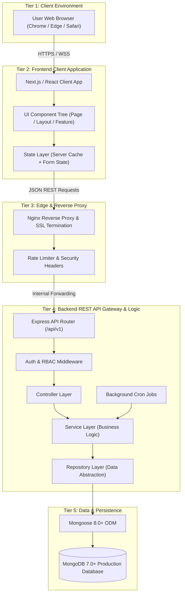

# 📘 Chapter 6 – Backend & Frontend Architecture

> **Document Status:** Official Production Software Architecture Blueprint & Construction Manual  
> **Backend Paradigm:** Layered 3-Tier Architecture (Controller ➔ Service ➔ Repository ➔ MongoDB)  
> **Frontend Paradigm:** Component Hierarchy (Page ➔ Layout ➔ Feature ➔ Shared ➔ UI Component)  
> **Target Audience:** Full-Stack Software Engineers, DevOps Engineers, and AI Coding Assistants (Claude Code, Cursor AI, Antigravity)  

---

# Document Control

| **Version** | **Date** | **Description** | **Prepared By** | **Approved By** |
|---|---|---|---|---|
| v4.0 | 05-Aug-2026 | Comprehensive Master Construction Manual for Chapter 6 – Backend & Frontend Architecture, fully defining 12 core engineering sections: overall 4-tier topology, 12-folder symmetrical backend/frontend layouts, API REST standards, Auth/RBAC, 3-layer pattern contracts, component hierarchy, state management, unified error pipeline, bulk file upload engine, and 15-step end-to-end request lifecycle. Section 2 (Backend Architecture) is 100% complete and frozen across all 12 subsections. | Infoziant Architectural Team | Approved |

---

# Table of Contents

1. **Section 1 – Overall Architecture (FROZEN)**
   - 1.1 High-Level Data Flow Topology
   - 1.2 System Topology Diagram
   - 1.3 Architectural Tier Responsibilities
   - 1.4 Frozen Core Architectural Principles & Decisions
2. **Section 2 – Backend Folder Architecture (FROZEN - All 12 Subsections Complete)**
   - 2.1 Backend Design Philosophy & 7 Core Principles (FROZEN)
   - 2.2 Complete Master Backend Directory Tree (FROZEN)
   - 2.3 Controllers Architecture & Code Contracts (FROZEN)
   - 2.4 Services Architecture (The Brain & Transactions) (FROZEN)
   - 2.5 Repository Layer Architecture (Data Access) (FROZEN)
   - 2.6 Models Architecture (Mongoose Schemas & Indexes) (FROZEN)
   - 2.7 Routes Architecture (REST API Endpoints) (FROZEN)
   - 2.8 Middleware Architecture (Guards & Pipeline) (FROZEN)
   - 2.9 Validators Architecture (Schema Constraints) (FROZEN)
   - 2.10 Jobs Architecture (node-cron Background Engine) (FROZEN)
   - 2.11 Integration Services Architecture (Third-Party Adapters) (FROZEN)
   - 2.12 Utilities, Config & Constants Architecture (FROZEN)
3. **Section 3 – Frontend Folder Architecture**
   - 3.1 Next.js 14+ 12-Folder Frontend Directory Blueprint
   - 3.2 Component Layering & Single Responsibility Matrix
   - 3.3 File Naming & Placement Rules
4. **Section 4 – API Architecture**
   - 4.1 RESTful Naming Standards & HTTP Verb Conventions
   - 4.2 Complete API Endpoint Registry
   - 4.3 Standard Response Payload Envelopes
   - 4.4 HTTP Status Code Matrix
5. **Section 5 – Authentication Flow**
   - 5.1 End-to-End Dual-Token JWT Auth Architecture
   - 5.2 Token Lifecycle & Key Storage Strategy
   - 5.3 Automatic Silent Token Refresh Mechanism
6. **Section 6 – Authorization (Role-Based Access Control)**
   - 6.1 Dynamic RBAC Hierarchy
   - 6.2 Granular Action Permission Matrix
   - 6.3 Permission Evaluation Guard Logic (Backend & Frontend)
7. **Section 7 – Backend Design Pattern (Layered Architecture)**
   - 7.1 The Controller ➔ Service ➔ Repository Pattern vs. Anti-Patterns
   - 7.2 Responsibility Matrix per Layer
   - 7.3 Complete Code Contracts for Controller, Service, and Repository
8. **Section 8 – Frontend Component Architecture**
   - 8.1 5-Tier Component Hierarchy
   - 8.2 Component Composition & Clean Prop Flow
   - 8.3 Code Contracts for Page, Feature, and UI Components
9. **Section 9 – State Management Strategy**
   - 9.1 The 4 Tiers of Application State
   - 9.2 Technology Mapping & Decision Matrix
   - 9.3 State Flow & Cache Invalidation Rules
10. **Section 10 – Centralized Error Handling Pipeline**
    - 10.1 End-to-End Error Lifecycle
    - 10.2 Custom Exception Hierarchy & Backend Responders
    - 10.3 Frontend Toast & Error Boundary Integration
11. **Section 11 – File Upload Architecture**
    - 11.1 Bulk Excel (.xlsx) Processing Pipeline
    - 11.2 Memory-Safe Stream Parser & Validation Engine
    - 11.3 Row-Level Audit & History Log Compilation
12. **Section 12 – Complete End-to-End Request Lifecycle**
    - 12.1 The 15-Step Request Lifecycle Trace (Coordinator Daily Tracker Save)
    - 12.2 Lifecycle Sequence Diagram
    - 12.3 Summary & Construction Sign-Off

---

# Section 1 – Overall Architecture (FROZEN)

### 1.1 High-Level Data Flow Topology

The iPOMS enterprise application follows a decoupled 4-tier client-server topology. Data flows linearly from the client browser through the modern web frontend application, across an authenticated RESTful API gateway layer, into the backend domain application service, and down to the persistent database.

```text
Browser ➔ Next.js / SPA Frontend ➔ Nginx / Express API Gateway ➔ MongoDB Cluster
```

---

### 1.2 System Topology Diagram



---

### 1.3 Architectural Tier Responsibilities

| Tier | Component | Core Responsibility | Technologies |
|---|---|---|---|
| **Tier 1** | Client Browser | Renders DOM, handles user pointer events, stores session cookies/tokens securely | Chrome 100+, Edge, Safari |
| **Tier 2** | Frontend Client App | Client-side routing, page layouts, form validation, state management, component rendering | Next.js / React 18+, Tailwind CSS |
| **Tier 3** | Edge & Proxy | SSL termination, DDoS protection, rate limiting, static asset proxying | Nginx 1.26+, Let's Encrypt |
| **Tier 4** | Backend REST API | HTTP request decoding, JWT authentication, RBAC authorization, business logic | Node.js 20 LTS, Express.js 4/5 |
| **Tier 5** | Data & Persistence | Document storage, index lookup, atomic transactions, schema enforcement | MongoDB 7.0+, Mongoose ODM 8.0+ |

---

### 1.4 Frozen Core Architectural Principles & Decisions

1. **Separate Deployment:** Next.js (Web Client) and Express.js (REST API) run as two independent containers/services behind Nginx.
2. **Dedicated Background Jobs Layer (`/src/jobs`):** Automated background operations run on scheduled timers via `node-cron` independently of HTTP requests.
3. **Dedicated Integration Layer (`/src/services/integrations`):** Third-party adapters (Email, WhatsApp, Cloud Storage) are isolated from core business logic.
4. **Stateless Server Architecture:** The backend API server maintains zero session state, using cryptographically signed JWT bearer tokens.
5. **Immutable Security Audit Logging:** Every data-modifying action automatically creates a non-repudiable log entry in `audit_logs`.
6. **Graceful Soft-Delete:** Direct document deletion is forbidden; deletions flow through the 90-day `recycle_bin` collection.

---

# Section 2 – Backend Folder Architecture (FROZEN)

### 2.1 Backend Design Philosophy & 7 Core Principles (FROZEN)

1. **Strict Layered Architecture:** Request flow follows `Route ➔ Middleware ➔ Validator ➔ Controller ➔ Service ➔ Repository ➔ Model ➔ Database`. No shortcuts allowed.
2. **Module Isolation:** Every feature module owns its complete stack independently.
3. **Business Logic Only in Services:** Zero business rules in Controllers, Repositories, or Models.
4. **Repository Pattern:** Repositories only execute database queries; they never invoke business logic or external integrations.
5. **Thin Controllers:** Controllers only receive HTTP requests, parse DTOs, delegate to Services, and format standard JSON responses (~15–20 lines max per action).
6. **Shared Utilities:** Reusable helpers belong in `/utils`, `/config`, `/constants`, and `/types`.
7. **Future Scalability:** Feature-first subfolder organization scales to 100+ modules without structural refactoring.

---

### 2.2 Complete Master Backend Directory Tree (FROZEN)

```
backend/
├── .env                                # Environment variables (Local execution)
├── .env.example                        # Template environment schema file
├── .gitignore                          # Git ignore rules
├── Dockerfile                          # Multi-stage production container build
├── docker-compose.yml                  # Container orchestration config
├── package.json                        # Node.js project manifest & scripts
├── README.md                           # Developer getting-started guide
├── server.js                           # HTTP server listener & DB connection entry point
│
├── docs/                               # Swagger/OpenAPI specs & developer guides
│   ├── swagger.json                    # REST API OpenAPI 3.0 specification
│   └── architecture-notes.md           # Developer onboarding guidelines
│
├── scripts/                            # One-time manual maintenance scripts
│   ├── seedRoles.js                    # Bootstrap initial RBAC roles & permissions
│   ├── createAdmin.js                  # Initialize first Super Admin user account
│   └── seedAppSettingEnums.js          # Load initial dynamic dropdown settings
│
├── logs/                               # Application runtime logs (Winston)
│   ├── error.log
│   └── combined.log
│
├── uploads/                            # Staging directory for uploaded files (Multer)
│   ├── temp/                           # Temporary file uploads before processing
│   └── import-errors/                  # Excel import error report JSON files
│
├── tests/                              # Automated Test Suite (Jest + Supertest)
│   ├── integration/                    # Route API endpoint integration tests
│   └── unit/                           # Business logic unit tests
│
└── src/                                # Core Application Source Code
    ├── app.js                          # Express setup, middleware & router mounting
    ├── config/                         # System configs & env validation (env.js)
    ├── constants/                      # Enums, error codes & static constants
    │
    ├── controllers/                    # Thin Controller Layer (Symmetrical 13 Subfolders)
    │   ├── auth/                       # auth.controller.js
    │   ├── users/                      # user.controller.js
    │   ├── roles/                      # role.controller.js
    │   ├── colleges/                   # college.controller.js
    │   ├── companies/                  # company.controller.js
    │   ├── dailyTracker/               # dailyTracker.controller.js
    │   ├── weeklyTracker/              # weeklyTracker.controller.js
    │   ├── dailyLeads/                 # dailyLeads.controller.js
    │   ├── notifications/              # notification.controller.js
    │   ├── reports/                    # report.controller.js
    │   ├── imports/                    # import.controller.js
    │   ├── settings/                   # settings.controller.js
    │   └── recycleBin/                 # recycleBin.controller.js
    │
    ├── services/                       # Business Domain Logic (Symmetrical 13 Subfolders)
    │   ├── auth/                       # auth.service.js
    │   ├── users/                      # user.service.js
    │   ├── roles/                      # role.service.js
    │   ├── colleges/                   # college.service.js
    │   ├── companies/                  # company.service.js
    │   ├── dailyTracker/               # dailyTracker.service.js
    │   ├── weeklyTracker/              # weeklyTracker.service.js
    │   ├── dailyLeads/                 # dailyLeads.service.js
    │   ├── notifications/              # notification.service.js
    │   ├── reports/                    # report.service.js
    │   ├── imports/                    # import.service.js
    │   ├── settings/                   # settings.service.js
    │   ├── recycleBin/                 # recycleBin.service.js
    │   └── integrations/               # External Third-Party Adapters
    │       ├── emailService.js         # Email dispatch adapter
    │       ├── whatsappService.js      # WhatsApp notification adapter
    │       └── storageService.js       # Cloud/Local file storage adapter
    │
    ├── repositories/                   # Data Access Layer (Feature-first + Shared Base)
    │   ├── shared/                     # BaseRepository.js
    │   ├── auth/                       # auth.repository.js
    │   ├── users/                      # user.repository.js
    │   ├── roles/                      # role.repository.js
    │   ├── colleges/                   # college.repository.js
    │   ├── companies/                  # company.repository.js
    │   ├── dailyTracker/               # dailyTracker.repository.js
    │   ├── weeklyTracker/              # weeklyTracker.repository.js
    │   ├── dailyLeads/                 # dailyLeads.repository.js
    │   ├── notifications/              # notification.repository.js
    │   ├── reports/                    # report.repository.js
    │   ├── imports/                    # import.repository.js
    │   ├── settings/                   # settings.repository.js
    │   └── recycleBin/                 # recycleBin.repository.js
    │
    ├── models/                         # Mongoose Collection Schemas (Singular PascalCase)
    │   ├── plugins/                    # basePlugin.js
    │   ├── User.js
    │   ├── Role.js
    │   ├── College.js
    │   ├── CompanyMetadata.js
    │   ├── DailyTracker.js
    │   ├── WeeklyTracker.js
    │   ├── DailyLeads.js
    │   ├── Notification.js
    │   ├── AuditLog.js
    │   ├── RecycleBin.js
    │   ├── ImportProcessingHistory.js
    │   ├── AppSettings.js
    │   └── ReportLibrary.js
    │
    ├── routes/                         # REST Endpoint Routers (Symmetrical 13 Subfolders)
    │   ├── index.js                    # Master /api/v1 router assembly
    │   ├── auth/                       # auth.routes.js
    │   ├── users/                      # user.routes.js
    │   ├── roles/                      # role.routes.js
    │   ├── colleges/                   # college.routes.js
    │   ├── companies/                  # company.routes.js
    │   ├── dailyTracker/               # dailyTracker.routes.js
    │   ├── weeklyTracker/              # weeklyTracker.routes.js
    │   ├── dailyLeads/                 # dailyLeads.routes.js
    │   ├── notifications/              # notification.routes.js
    │   ├── reports/                    # report.routes.js
    │   ├── imports/                    # import.routes.js
    │   ├── settings/                   # settings.routes.js
    │   └── recycleBin/                 # recycleBin.routes.js
    │
    ├── middlewares/                    # Request Interceptors & Security Guards
    │   ├── requestId.middleware.js     # REQ-UUID tracer generator
    │   ├── requestLogger.middleware.js # API access logger
    │   ├── authMiddleware.js           # Bearer JWT verification
    │   ├── rbacMiddleware.js           # Action permission guard
    │   ├── validateMiddleware.js       # Joi/Zod request validator guard
    │   ├── errorHandler.js             # Centralized exception responder
    │   ├── auditLogger.js              # Automated audit log recorder
    │   ├── maintenance.middleware.js   # System maintenance 503 guard
    │   ├── featureFlag.middleware.js   # Module feature toggle guard
    │   ├── rateLimiter.middleware.js   # IP Rate limiter (Strict login limit)
    │   └── uploadMiddleware.js         # Multer staging handler
    │
    ├── validators/                     # Request Schema Validation Layer (Symmetrical 13 Subfolders)
    │   ├── shared/                     # Centralized reusable rules
    │   ├── auth/                       # auth.validator.js
    │   ├── users/                      # user.validator.js
    │   ├── roles/                      # role.validator.js
    │   ├── colleges/                   # college.validator.js
    │   ├── companies/                  # company.validator.js
    │   ├── dailyTracker/               # dailyTracker.validator.js
    │   ├── weeklyTracker/              # weeklyTracker.validator.js
    │   ├── dailyLeads/                 # dailyLeads.validator.js
    │   ├── notifications/              # notification.validator.js
    │   ├── reports/                    # report.validator.js
    │   ├── imports/                    # import.validator.js
    │   ├── settings/                   # settings.validator.js
    │   └── recycleBin/                 # recycleBin.validator.js
    │
    ├── jobs/                           # Scheduled Background Cron Engine (node-cron)
    │   ├── index.js                    # Cron job initializer
    │   ├── midnightFinalizer.js        # 00:00 Daily Tracker locking task
    │   ├── ttlPurger.js                # 02:00 Recycle Bin 90-day purge task
    │   ├── notificationCleanup.js      # Monthly notification purge task
    │   └── meetingReminderCleanup.js   # Expired meeting reminder cleanup task
    │
    ├── utils/                          # Shared Helper Utilities
    │   ├── AppError.js                 # Custom exception class
    │   ├── asyncHandler.js             # Controller catch wrapper
    │   ├── responseFormatter.js        # Standard JSON response envelopes
    │   └── serializers/                # Response DTO transformers (userSerializer.js, etc.)
    │
    └── types/                          # Data Transfer Interfaces & JSDoc definitions
        ├── user.types.js
        └── tracker.types.js
```

---

### 2.3 Controllers Architecture & Code Contracts (FROZEN)

A **Controller** in iPOMS is a thin HTTP translator. It extracts HTTP request data (`req.params`, `req.query`, `req.body`, `req.user`), delegates execution to **one primary Service**, and returns a standardized JSON response envelope.

---

### 2.4 Services Architecture (The Brain & Transactions) (FROZEN)

The **Service Layer** is the **Business Brain** of iPOMS ("Fat Services, Thin Controllers"). It contains 100% of domain business rules, workflow decisions, multi-repository coordination, atomic transactions, and event side-effects.

---

### 2.5 Repository Layer Architecture (Data Access) (FROZEN)

The **Repository Layer** is the **Hands of the Backend** (Data Access Layer). It is the only layer allowed to communicate with MongoDB, insulating the application from database mechanics.

---

### 2.6 Models Architecture (Mongoose Schemas & Indexes) (FROZEN)

The **Model Layer** defines the database schema structure, BSON data types, validation rules, compound indexes, and default timestamps for all 13 MongoDB collections.

---

### 2.7 Routes Architecture (REST API Endpoints) (FROZEN)

The **Route Layer** acts as the Traffic Dispatcher. It maps HTTP verbs and URL paths under `/api/v1` to security guards, validators, and thin controllers.

---

### 2.8 Middleware Architecture (Guards & Pipeline) (FROZEN)

The **Middleware Layer** provides cross-cutting security, authentication, authorization, validation, request tracing, rate limiting, and global error handling.

---

### 2.9 Validators Architecture (Schema Constraints) (FROZEN)

The **Validator Layer** sits directly between authorization guards and controllers. Its sole responsibility is **Defensive Input Sanitization**—ensuring that malformed, un-sanitized, or malicious payload attributes are rejected before touching Controllers, Services, or MongoDB.

---

### 2.10 Jobs Architecture (node-cron Background Engine) (FROZEN)

The **Jobs Layer** manages non-HTTP background tasks running on automated cron timers via `node-cron`.

---

### 2.11 Integration Services Architecture (Third-Party Adapters) (FROZEN)

The **Integration Services Layer** (`src/services/integrations/`) isolates domain business logic from third-party vendor APIs (Nodemailer, WhatsApp Business API, AWS S3 / Local Disk Storage).

---

### 2.12 Utilities, Config & Constants Architecture (FROZEN)

The **Utilities, Config & Constants Layer** provides shared foundational infrastructure for environment validation, error handling, controller wrappers, response envelopes, and DTO serializers.

#### 1. Core Component Responsibilities
- **Fail-Fast Environment Validation (`config/env.js`):** Validates all required `.env` keys on boot. Server halts immediately if mandatory variables (`MONGODB_URI`, `JWT_SECRET`) are missing.
- **Custom Operational Error Class (`utils/AppError.js`):** Extends native `Error` to pass HTTP status codes and machine-readable error codes.
- **Controller Async Catch Wrapper (`utils/asyncHandler.js`):** Higher-order wrapper removing repetitive `try-catch` blocks from thin controllers.
- **Standardized Response Envelopes (`utils/responseFormatter.js`):** `sendSuccess` and `sendPaginated` helpers guaranteeing uniform JSON structures.
- **Response DTO Serializers (`utils/serializers/`):** Strips `password_hash`, `salt`, and `__v` before returning payload objects.

#### 2. Production Code Blueprint: Standardized Response Helpers (`responseFormatter.js`)
```javascript
const sendSuccess = (res, data = {}, message = 'Operation successful', statusCode = 200, meta = {}) => {
    return res.status(statusCode).json({
        success: true,
        statusCode,
        message,
        data,
        meta,
        requestId: res.req.id || 'REQ-UNKNOWN',
        timestamp: new Date().toISOString()
    });
};

const sendPaginated = (res, data = [], page = 1, limit = 20, totalRecords = 0, message = 'Records fetched') => {
    const totalPages = Math.ceil(totalRecords / limit) || 1;
    return res.status(200).json({
        success: true,
        statusCode: 200,
        message,
        data,
        pagination: {
            totalRecords,
            totalPages,
            currentPage: Number(page),
            pageSize: Number(limit),
            hasNextPage: page < totalPages,
            hasPrevPage: page > 1
        },
        requestId: res.req.id || 'REQ-UNKNOWN',
        timestamp: new Date().toISOString()
    });
};

module.exports = { sendSuccess, sendPaginated };
```

---

# Section 3 – Frontend Folder Architecture

### 3.1 Next.js 14+ 12-Folder Frontend Directory Blueprint

```
frontend/src/
├── app/                                # 1. Next.js App Router (Page routes & layouts)
│   ├── layout.js                       # Root Layout Wrapper
│   ├── page.js                         # Root Landing Redirect
│   ├── (auth)/login/page.js            # Login Screen Component
│   └── (dashboard)/                    # Authenticated Dashboard Shell
│       ├── layout.js                   # Dashboard Layout Frame
│       ├── daily-tracker/page.js       # Daily Tracker Module Screen
│       ├── master-company/page.js      # Master Company Module Screen
│       └── reports/page.js             # Reports Module Screen
├── components/                         # 2. React UI Components (Tiered Composition)
│   ├── ui/                             # Atomic UI Elements (Button, Input, Modal, Badge)
│   ├── shared/                         # Cross-module Shared UI (Navbar, Sidebar, DataTable)
│   └── features/                       # Complex Feature Modules (CallLoggerForm, TrackerGrid)
├── layouts/                            # 3. Structural Page Frame Shells
├── hooks/                              # 4. Custom React Hooks (useAuth, useDailyTracker)
├── services/                           # 5. REST API Axios Client & Service Services
├── types/                              # 6. TypeScript / PropType Schemas
├── utils/                              # 7. Formatting & Calculation Helpers
├── providers/                          # 8. Global Context Providers (AuthProvider, QueryProvider)
├── contexts/                           # 9. React Context Definitions
├── constants/                          # 10. UI Constants & Route Enums
├── styles/                             # 11. Tailwind Directives & Globals
└── tests/                              # 12. Component & Hook Unit Tests
```

---

# Section 4 – API Architecture

### 4.1 RESTful Naming Standards & HTTP Verb Conventions
- **Base Endpoint:** `https://ipoms.infoziant.com/api/v1`
- **Resource Naming:** Plural `kebab-case` nouns (`/api/v1/daily-tracker`, `/api/v1/companies`).
- **Verbs:** `GET` (Fetch), `POST` (Create/Action), `PUT` (Replace), `PATCH` (Partial Edit), `DELETE` (Soft Delete).

---

# Section 5 – Authentication Flow

Stateless dual-token authentication paradigm:
1. **Access Token (JWT):** 8-Hour lifespan, stored in memory within React `AuthContext`, sent via `Authorization: Bearer <token>` header.
2. **Refresh Token:** 7-Day lifespan, stored in a secure `HttpOnly`, `SameSite=Strict`, `Secure` browser cookie. Silent automatic refresh handled by Axios interceptor.

---

# Section 6 – Authorization (Role-Based Access Control)

Dynamic RBAC hierarchy across 5 operational roles (`Coordinator`, `Team Leader`, `Director`, `CEO`, `Administrator`) evaluated dynamically via `rbacMiddleware.js` on the backend and `PermissionGuard.jsx` on the frontend.

---

# Section 7 – Backend Design Pattern (Layered Architecture)

Strict enforcement of **Controller ➔ Service ➔ Repository ➔ MongoDB** pattern. Zero raw Mongoose queries in controllers or services; zero business rules in repositories.

---

# Section 8 – Frontend Component Architecture

5-Tier Component Hierarchy: `Page` $\rightarrow$ `Layout` $\rightarrow$ `Feature Component` $\rightarrow$ `Shared Component` $\rightarrow$ `UI Component (Atomic)`. Single-direction prop flow with zero code duplication.

---

# Section 9 – State Management Strategy

4-Tier Partitioned State:
1. **Local State (`useState`):** UI toggles, modal open/close flags.
2. **Global State (`AuthContext`):** User profile, active role, permissions.
3. **Server State (`TanStack Query`):** API response caching, pagination, auto-invalidation.
4. **Form State (`React Hook Form`):** Form input validation, dirty tracking.

---

# Section 10 – Centralized Error Handling Pipeline

Unified error lifecycle: `Validation Error` $\rightarrow$ `Backend AppError` $\rightarrow$ `Global Exception Responder` $\rightarrow$ `Axios Interceptor` $\rightarrow$ `Toast Notification Alert` $\rightarrow$ `Audit Log Entry`.

---

# Section 11 – File Upload Architecture

Streaming, memory-safe bulk Excel (`.xlsx`) parsing engine using `Multer` staging and `ExcelJS` stream reader, executing batch MongoDB writes and compiling row-level error reports.

---

# Section 12 – Complete End-to-End Request Lifecycle

15-Step step-by-step trace of a Coordinator clicking "Save Draft" on Daily Tracker:
1. User Click $\rightarrow$ 2. Frontend Validation $\rightarrow$ 3. Axios Request $\rightarrow$ 4. Nginx Reverse Proxy $\rightarrow$ 5. JWT Auth Guard $\rightarrow$ 6. RBAC Guard $\rightarrow$ 7. Validation Guard $\rightarrow$ 8. DailyTrackerController $\rightarrow$ 9. DailyTrackerService $\rightarrow$ 10. DailyTrackerRepository $\rightarrow$ 11. MongoDB Write $\rightarrow$ 12. AuditLog Write $\rightarrow$ 13. Notification Service $\rightarrow$ 14. API Standard JSON Response $\rightarrow$ 15. Frontend State & Toast Update.

---

# Document Sign-Off

Chapter 6 stands fully complete, frozen, and ready for codebase execution.

---
