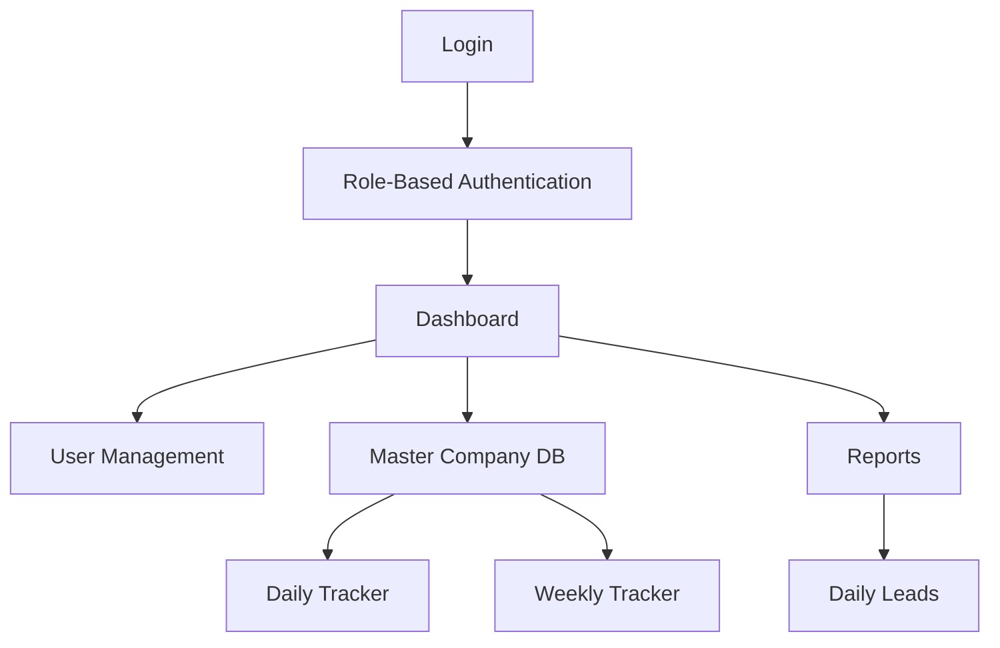

# iPOMS — Complete Project Analysis

> **Infoziant Placement Operations Management System (iPOMS)**
> *"Empowering Placement Teams with Intelligent Operations."*

---

## 1. Project Overview

**iPOMS** is an **enterprise-grade internal platform** built for **Infoziant IT Solutions Inc.** to digitize and streamline the daily operations of their placement team — a group of ~20–25 coordinators, team leaders, and administrators who manage company outreach, placement drives, and college relations.

| Field | Value |
|---|---|
| **Company** | Infoziant IT Solutions Inc. |
| **Tagline** | *Empowering Placement Teams with Intelligent Operations* |
| **Certification** | SOC 2 \| ISO 27001:2022 |
| **Prepared By** | A. Mohanaradha, Infoziant |
| **Document Dates** | 22–26 July 2026 |
| **Version** | v1.0 (all modules) |
| **Status** | Business Design Complete — Approved for Internal Review |

---

## 2. Project Folder Structure

```
iPOMS/
├── approval documents/
│   ├── AI quotation.pdf
│   ├── Placement_Coordinator_Workflow_Highlights.docx
│   └── Placement_Coordinator_Workflow_SOP.docx
│
├── company logo/
│   └── infoziant Logo.png
│
├── github repo/
│   └── placement-operations-management-system/
│       ├── .git/
│       ├── .gitignore        ← Node.js-centric (Next.js, Vite, etc.)
│       └── README.md         ← Minimal — "Private Development Repository"
│
└── version 1/
    ├── Assets/
    │   └── system_architecture.png
    ├── HTML files/
    │   └── module 1.html
    ├── Module Workflow/
    │   ├── POMS_System_Architecture.pdf
    │   ├── chapter 1 - Design_Foundation_v1.0.docx
    │   ├── Chapter_02_UI_Enterprise_Component_Library.docx
    │   ├── Chapter_03_UI_Screen_Blueprint_System.docx
    │   └── Module_01 through Module_10 .docx specs
    ├── PDF/                  ← (empty)
    ├── Presentations/
    │   ├── POMS_System_Architecture.pptx
    │   └── iPOMS_Project_Presentation v1–v3.pptx
    ├── Prompt Sources/       ← 12 docx files (original AI prompts)
    ├── module md files/      ← 13 markdown specs (canonical)
    └── prompt md files/      ← 12 markdown prompt transcripts
```

> [!IMPORTANT]
> The **GitHub repo is essentially empty** — it contains only a `.gitignore` (Node.js template) and a one-line `README.md`. **No source code has been written yet.** The project is currently in the **specification/design phase**.

---

## 3. System Architecture

The system follows a simple flow:



**Data Flow:**
> Master Company Database → Daily Tracker → Weekly Tracker → Dashboard & Reports

---

## 4. Design Foundation (Chapter 1)

### Visual Identity
| Element | Decision |
|---|---|
| **Primary Color** | Deep Blue (brand-derived) |
| **Secondary** | Cyan / Teal |
| **Success** | Green |
| **Warning** | Amber |
| **Error** | Red |
| **Font** | Inter |
| **Corner Radius** | 8px (medium) |
| **Elevation** | Soft shadows |
| **Theme** | Light Mode only (v1.0); Dark Mode forward-compatible |

### Design Language
> Microsoft 365 + Linear + Airtable + Modern CRM + Excel Productivity
> Explicitly **avoided**: heavy dashboards, dark-only themes, glassmorphism, decorative gradients.

### Application Shell
Every module shares the same shell:
- **Header** (branding, global search, notifications, profile)
- **Collapsible Sidebar** (72–80px collapsed, 240–260px expanded)
- **Breadcrumb + Module Title**
- **Toolbar** (module-specific actions)
- **KPI Cards** (optional)
- **Main Data Grid** (table-first design)
- **Bottom Status Bar** (save status, record counts)

### Navigation Order
1. Dashboard
2. User Management
3. Master Company Database
4. Daily Tracker
5. Weekly Tracker
6. Daily Leads (added in Module 05)
7. Reports & Analytics
8. Settings

### Chapter 2 — UI Enterprise Component Library
Defines **11 reusable component systems** built on top of Chapter 1:

| # | Component System | Status |
|---|---|---|
| 1 | Enterprise Button System | Frozen |
| 2 | Enterprise Input System (+ Form Layout Rules) | Frozen |
| 3 | Enterprise Data Grid (Table System) | Frozen |
| 4 | Enterprise Card System | Frozen |
| 5 | Enterprise Navigation System | Frozen |
| 6 | Status & Badge System | Frozen |
| 7 | Notification System | Frozen |
| 8 | Modal & Dialog System | Frozen |
| 9 | Charts & Analytics System | Frozen |
| 10 | Utility Components | Frozen |
| 11 | Feedback Components | Frozen |

Key principle: **"Consistency over creativity"** — one signature interaction language reused everywhere.

### Chapter 3 — UI Screen Blueprint System
Defines the actual page-level designs. **10 of 15 screens frozen**:

| # | Screen | Status |
|---|---|---|
| 1 | Authentication (Login) | Frozen |
| 2 | Forgot Password | Frozen |
| 3 | Placement Coordinator Dashboard | Frozen |
| 4 | Team Leader Dashboard | Frozen |
| 5 | Executive Dashboard (Director/CEO) | Frozen |
| 6 | Daily Tracker | Frozen |
| 7 | Weekly Tracker | Frozen |
| 8 | Daily Leads | Frozen |
| 9 | Master Company Database | Frozen |
| 10 | Reports & Analytics | Frozen |

Remaining 5 screens (Notifications, Profile, Settings, System Management, +1) reuse the same design system.

### Key Decisions
- **Command Palette (Ctrl+K)** → Rejected
- **Recently Visited** → Deferred
- **Dark Mode** → Deferred (v1.0 is Light only)

---

## 5. User Roles & Permissions

| Role | Purpose |
|---|---|
| **Placement Coordinator** | Operational user; makes calls, tracks daily activities |
| **Team Leader** | Supervises coordinators; verifies data; manages company DB |
| **Administrator (CEO/Director)** | Full system access; governance; configuration |
| **TPO (Training & Placement Officer)** | Read-only stakeholder monitoring placement performance |

---

## 6. Module Specifications

### Module 01 — User Management
- Single unified login for all roles → role-based redirect to dashboard
- Username + Password login (no email login in v1.0)
- Forgot Password via OTP flow
- User Profile: Employee ID, Full Name, Username, Email, Mobile, Assigned Colleges, Role, Status
- Account statuses: Active, Inactive, On Leave, Resigned
- RBAC enforced on every request

### Module 02 — Master Company Database
- **Not a CRM** — a live, Excel-like operational repository
- ~5,000–8,000 companies, growing to 10,000+
- Company identified by **name only** (no internal ID)
- One company → unlimited HR contacts
- Duplicate detection: Company + HR + Mobile + Email
- Simultaneous multi-user editing with presence indicators
- Recycle Bin instead of permanent delete
- Audit trail: Created By, Created On, Last Updated By, Last Updated On

### Module 03 — Daily Tracker (The Heartbeat)
- Coordinator's **primary daily workspace** (~50–70 calls/day)
- Monthly tracker model (e.g., "July Tracker 2026")
- **Read-Only Contact Picker** from Master Company DB
- Time tracking: Manual Start Time (Spacebar shortcut) → Auto End Time (on outcome select) → Auto Duration
- Keyboard-first: Space → Call → Outcome → Enter → repeat
- Call Outcomes: No Response, Invalid, Not Hiring, Already Connected, Follow Up, Invite Mail, Drive Scheduled/In Progress/Completed
- **No Response 2** — secondary lifecycle deferred to Weekly Tracker
- Soft validation at Submit Day (warns, never blocks)
- Auto-save per row + manual Ctrl+S + final Submit Day

### Module 04 — Weekly Tracker (Placement Lifecycle)
- Tracks companies from first positive response → drive completion + offers
- **One master table, multiple views** (replaces 6 manual Excel tables)
- Sections: Pipeline, In Progress, Completed, Top Companies, Rejected by HR, Rejected by College
- Automatic section placement based on Status
- Friday-to-Friday week selector
- Free-text Status field (not rigid dropdown)
- Follow-up Date with color indicators (Green >7d, Yellow ≤3d, Red = today/overdue)
- KPI cards: Pipeline, In Progress, Completed, Rejected, Follow-ups Due Today, Top Companies

### Module 05 — Daily Leads
- Two-tab register: **Positives** and **JD Received**
- Excel-style tabs (instant switch, no page refresh)
- Identical column structure: S.No, Time, Date, Company, Role, CTC, College, Eligible Batch
- Only Coordinators can Add/Edit/Delete; others read-only
- **Intentionally manual** — not auto-synced from other modules
- Optional "Copy from Daily Tracker" shortcut

### Module 06 — Reports & Analytics (BI Center)
- **Three sections**: Analytics (live, never exported), Reports Library, Report Builder
- **Four report templates**: Weekly Placement, Monthly Placement, College Performance, Coordinator Performance
- Report Builder: Select Type → Filters → Auto-Branding → Choose Sections → Preview → Edit → Export
- **Native Report Editor** (Google Docs-like; Canva rejected as dependency)
- Export: PDF, Excel, PNG
- Reports **never stored** inside iPOMS — user downloads to local machine
- Insights Panel: auto-generated observations (Coordinator, Company, College, Trend)
- Rejected: Daily Report, Company Report, Pipeline Report, Conversion Report, Custom Reports

### Module 07 — Role-Based Dashboard
- **Home screen / Landing page / Operational Command Center**
- Purpose: Inform → Guide → Never make users work from dashboard
- Three dashboards: Coordinator, Team Leader, Administrator
- Sections: Greeting, Notifications, Assigned Work, Priority College, Today's Tasks, KPI Summary, Quick Navigation, Insights
- **Assigned Work** — signature feature: TL/Admin assigns tasks to coordinators
- **Metadata Merge Engine** — handles cross-module data unification

### Module 08 — User & Access Management
- Identity & Access Control Center
- Registration, Login, Profiles, Roles, College Assignment, Password Management
- User statuses expanded: Active, Partial Working, On Leave, Inactive, Blocked, Deactivated
- **Blocked vs Deactivated** distinction
- No temporary passwords — users always manage their own
- Password policy: 8+ chars, uppercase, lowercase, number, special character
- Profile Card UI (not inline table edit)
- College assignment workload rule: ~3 colleges per coordinator

### Module 09 — Settings & Configuration
- Five sections via left-side nav: My Profile, Security, Application Settings, Organization Settings, System Settings
- Core rule: **Settings customizes appearance, never alters business logic**
- Themes: Light, Dark, High Contrast, System Default
- Configurable landing page (Dashboard, Daily Tracker, or Weekly Tracker)
- Date format: "24 July 2026"; Time: 12-hour with AM/PM
- Organization branding: logo, name, report footer (Director/CEO only)
- Privacy & Visibility: personal data visible only to management
- System Announcement Banner

### Module 10 — System Information & Administration
- Compact management dashboard (not a server admin console)
- Director/CEO only
- Eight sections: System Health, Organization Snapshot, Database Growth, Data Quality Monitor, Storage Summary, Version Info, Announcement Management, Maintenance Mode
- **Data Quality Monitor**: metadata quality %, duplicate companies, missing emails/mobiles
- Overall Status Banner: Healthy (green), Attention Required (amber), Critical Issue (red)

---

## 7. Current Project State

| Aspect | Status |
|---|---|
| **Business Specifications** | ✅ Complete (10 modules + Design Foundation + 2 UI chapters) |
| **UI Component Library** | ✅ Frozen (Chapter 02 — 11 component systems) |
| **Screen Blueprints** | ✅ Frozen (Chapter 03 — 10 of 15 screens) |
| **Source Code** | ❌ **Not started** — GitHub repo is empty |
| **Tech Stack Decision** | ⏳ Implied Node.js/.gitignore suggests Next.js or similar |
| **Backend Decision** | ⏳ Firebase or MongoDB Atlas mentioned but not finalized |
| **Database Design** | ⏳ Not yet created (business-level data models specified) |
| **Deployment** | ⏳ Not yet planned |

> [!NOTE]
> The project is in the **pre-development phase**. All 10 module specifications plus 3 design foundation chapters are complete and pending CEO/Director approval. No code has been written yet.

---

## 8. Key Technical Implications

1. **Table-first design** — needs a powerful data grid component (AG Grid, TanStack Table, etc.)
2. **Real-time collaboration** — Master Company DB requires presence indicators and conflict resolution
3. **Keyboard-first UX** — Daily Tracker needs custom keyboard shortcuts (Spacebar, Tab, Enter)
4. **Role-based access** — 4 roles with granular per-feature permissions
5. **Report Builder** — needs a native document editor (not Canva)
6. **Auto-save** — per-row auto-save in Daily Tracker
7. **Multi-college support** — data filtered by coordinator → college assignment
8. **Offline/sync** — not explicitly required but implied by sync/refresh controls
9. **Export** — PDF, Excel, PNG export capabilities needed
10. **Scalable** — designed for 20–25 users now, but architecture should handle 100+ coordinators
